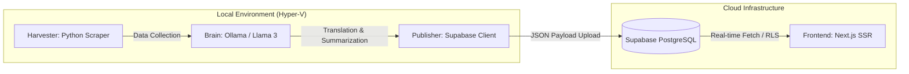
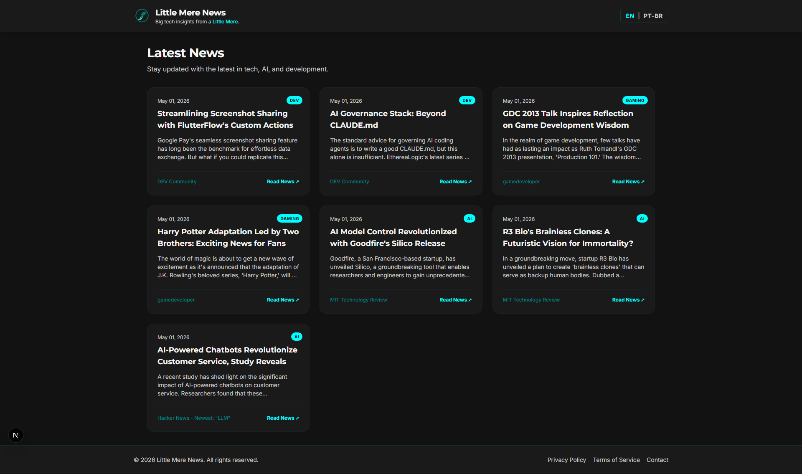
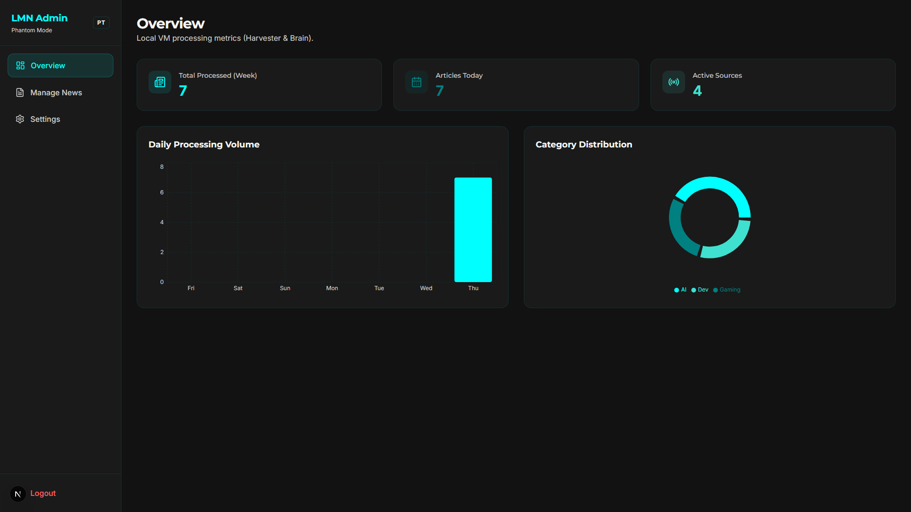
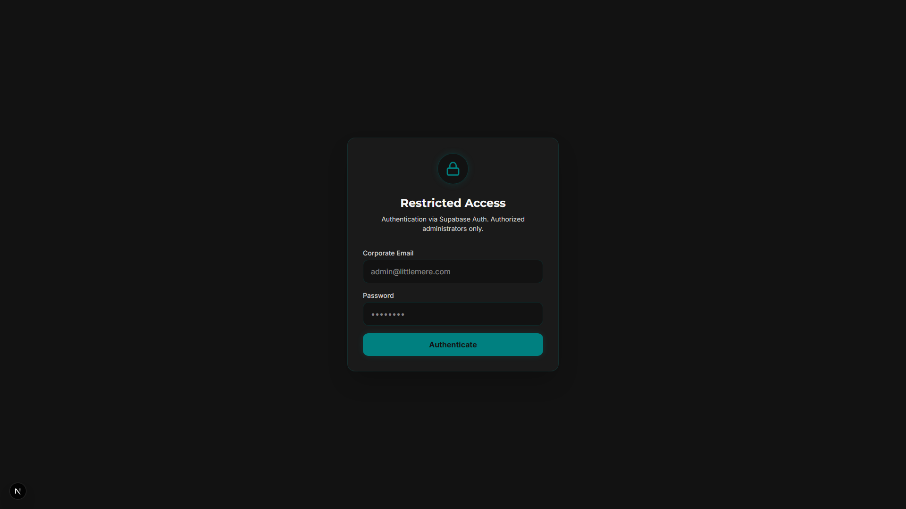
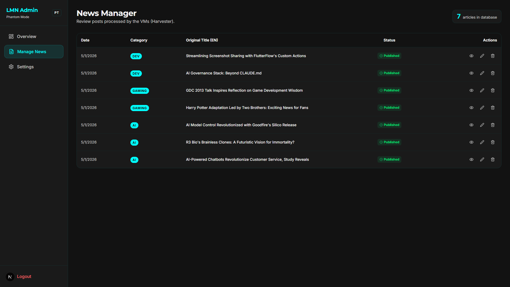
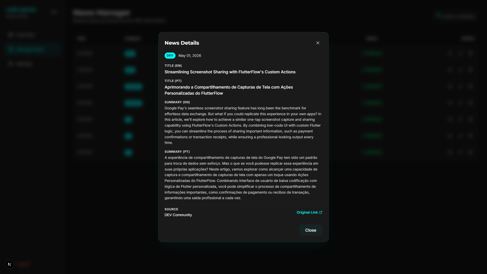
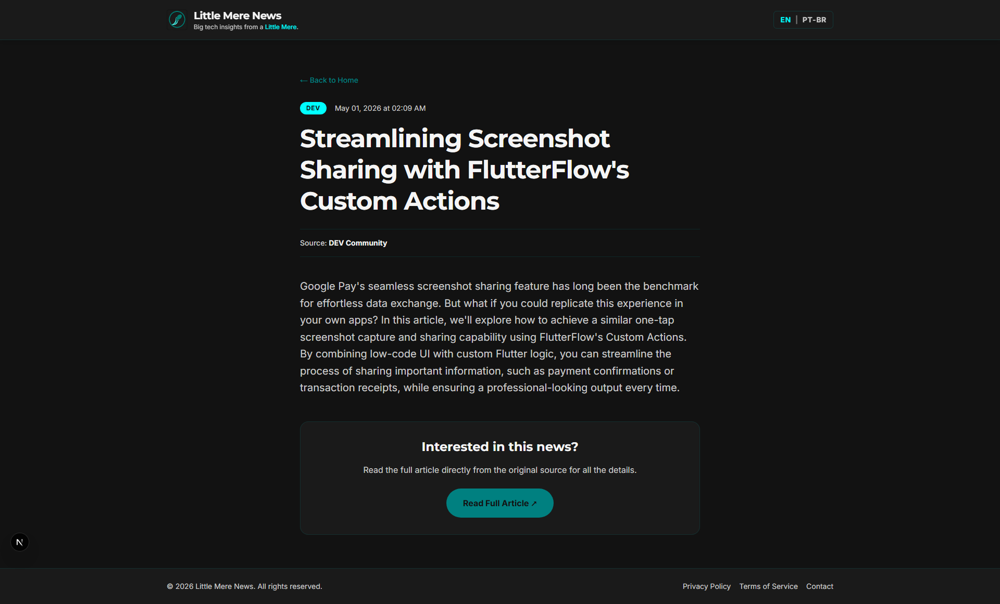

# Little Mere News

[](https://github.com/Gyliardson/little-mere-news/blob/main/README.md)
[](https://github.com/Gyliardson/little-mere-news/blob/main/README.pt-br.md)

An automated, bilingual technology news platform utilizing Local Artificial Intelligence (LLMs) and on-demand batch processing to minimize cloud operational costs.


## System Architecture

Little Mere News employs a **Batch Processing** pattern combined with a hybrid (Local + Cloud) infrastructure. Instead of paying for expensive cloud GPUs that run 24/7, all compute-intensive tasks (web scraping and AI inference) are executed locally on an isolated Hyper-V cluster.

### Local Infrastructure & AI Pipeline

This cluster is automatically provisioned and booted on-demand via a PowerShell orchestrator. It processes the daily news, uploads the formatted data to the cloud, and subsequently shuts down to conserve local hardware resources.



### Frontend & Administrative Panel

The frontend is built with Next.js using the App Router, featuring Server-Side Rendering (SSR) for optimal SEO and performance. The system includes a fully functional Content Management System (CMS) tailored for the administration of the news corpus.

#### Defense-in-Depth Security

The administration panel relies on a layered security model:

1. **The "Phantom Route" (Obfuscation):** The administrative dashboard is not accessible via a standard `/admin` URL. Instead, it utilizes a dynamic route parameter `[secret_admin]`, populated by an environment variable (`ADMIN_PHANTOM_PATH`). This acts as an initial mitigation against automated vulnerability scanners and brute-force bots, drastically reducing server noise.
2. **SSR Authentication (Cryptographic Verification):** The core security is guaranteed by Supabase Auth integrated directly into the Next.js middleware and server components. Even if the "Phantom Route" is discovered, unauthorized access is completely blocked at the server level; no sensitive data is transmitted to an unauthenticated client.
3. **Row Level Security (RLS):** Data integrity is enforced at the database layer (see the Supabase Technical Manual below).

#### CMS Functionality

The dashboard provides real-time metrics and full CRUD capabilities through modern, accessible modal interfaces. Features include:
* **Interactive Dashboard:** Real-time visualization of processed volume and active sources.
* **Inline Editing:** Quick approval and modification of AI-generated articles using synchronized state management.
* **Internationalization (i18n):** Both the public portal and the admin dashboard are fully localized in English and Portuguese.

#### Route Structure Table

| Route Pattern | Access Level | Description |
| :--- | :--- | :--- |
| `/[lang]` | Public | Main localized portal (Home). |
| `/[lang]/news/[slug]` | Public | Detailed view of a specific article. |
| `/[lang]/[secret_admin]/login` | Unauthenticated | Entry point to acquire a Supabase session. |
| `/[lang]/[secret_admin]/(dashboard)` | **Authenticated Admin** | Protected CMS overview and metric charts. |
| `/[lang]/[secret_admin]/(dashboard)/news` | **Authenticated Admin** | Protected route for editing and managing articles. |

## User Interface & Features

<p align="center">
  
  <br>
  <em>Figure 1: Comprehensive walkthrough demonstrating the authentication process, dashboard overview, and news management flow.</em>
</p>

### Public Portal vs. Administrative Dashboard

| Public Portal (Home) | Administrative Dashboard |
| :---: | :---: |
|  |  |
| <em>Figure 2: The bilingual public-facing portal displaying aggregated technology news.</em> | <em>Figure 3: Administrative Dashboard illustrating real-time server-side news aggregation metrics.</em> |

### Content Management & Authentication

| Secure Login Interface | CMS Article Management |
| :---: | :---: |
|  |  |
| <em>Figure 4: The Phantom Route authenticated login interface utilizing Supabase SSR.</em> | <em>Figure 5: The CMS list view providing real-time status and quick actions for articles.</em> |

| CMS Actions Menu | Detailed Article View |
| :---: | :---: |
|  |  |
| <em>Figure 6: Contextual actions menu facilitating efficient content modification and state transitions.</em> | <em>Figure 7: Server-Side Rendered detailed article view ensuring optimal SEO performance.</em> |

## Repository Structure

The project is modularized to reflect its microservices architecture:

* `/Infrastructure`: Idempotent PowerShell and Bash scripts utilized to provision the Hyper-V environment and the Batch Orchestrator. Scripts are standardized in English.
* `/Backend-Harvester`: Python codebase responsible for polling RSS feeds and technology website APIs to extract raw articles.
* `/Backend-Publisher`: Python codebase that receives processed text and performs sanitized Upserts into the Supabase relational tables.
* `/Frontend-Web`: The user interface and SSR application hosted on Render, dynamically consuming data directly from the Supabase endpoint.

## Setup & Configuration

This project relies on environment variables for both the local infrastructure and the cloud-hosted frontend.

### 1. Root Infrastructure (.env)
Used by PowerShell and Python scripts to communicate with Supabase.
1. Copy `.env.example` to `.env`.
2. Fill in your `SUPABASE_URL` and `SUPABASE_KEY` (service_role).

### 2. Frontend Web (.env.local)
Used by the Next.js application.
1. Navigate to `/frontend-web`.
2. Copy `.env.example` to `.env.local`.
3. Fill in the public and private keys, including the `ADMIN_PHANTOM_PATH`.

### 3. Supabase Technical Manual (Keys & RLS)

To ensure the security model functions correctly for new deployments, the Supabase PostgreSQL database must be configured with Row Level Security (RLS). 

**Best Practices Setup:**
1. **Enable RLS:** Navigate to the Authentication -> Policies tab in your Supabase dashboard and enable RLS on the `news` table.
2. **Public Read Access:** Create a policy allowing `SELECT` operations for the `anon` (anonymous) role. This permits the Next.js public routes to fetch articles.
    ```sql
    -- Example Policy: "Allow public read access"
    CREATE POLICY "Allow public read access" ON "public"."news"
    FOR SELECT USING (true);
    ```
3. **Admin Write Access:** Create policies for `INSERT`, `UPDATE`, and `DELETE` that are restricted strictly to the `authenticated` role (and optionally, specific admin user UUIDs).
    ```sql
    -- Example Policy: "Allow admins to update"
    CREATE POLICY "Allow admins to update" ON "public"."news"
    FOR UPDATE USING (auth.role() = 'authenticated');
    ```
4. **Service Role (Local Batch):** The `LMN-Publisher` running locally utilizes the `service_role` key, which inherently bypasses RLS to perform bulk upserts safely from the isolated Hyper-V environment. **Never expose the `service_role` key in the frontend.**

## License

This project is licensed under a Custom MIT License. You are free to use, modify, and distribute this software for personal and educational purposes. **Commercial use is permitted but strictly requires visible attribution to the author in both the code and the final product.** 

*Disclaimer: The author is not responsible for data loss or damages caused by the use of this code. Jurisdiction for any disputes is exclusively in Brazil.* See the [LICENSE](LICENSE) file for full details.

## Contributing & Git Standards

To maintain a clean and comprehensible commit history, this repository follows a structured commit message pattern. All subsequent commits must adhere to the following format:

* `[Version] | Feature | Description` (For new features)
* `[Version] | Fix | Description` (For bug fixes)
* `[Version] | Docs | Description` (For documentation updates)
* `[Version] | Refactor | Description` (For code refactoring without visual impact)

**Example:**
`v1.0.1 | Fix | Resolves issue with pagination in the admin dashboard`
