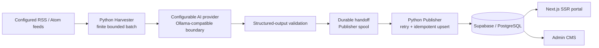

<div align="center">

# Little Mere News

**A deterministic technology-news pipeline with explicit AI, queue, and authorization boundaries.**

Little Mere News combines a Next.js portal and CMS, finite Python RSS/Atom ingestion, a configurable AI provider boundary, durable publication queues, and Supabase/PostgreSQL authorization controls.

[English](README.md) · [Português](docs/i18n/pt-BR/README.md) · [日本語](docs/i18n/ja/README.md) · [Español](docs/i18n/es/README.md)

[](https://github.com/Gyliardson/little-mere-news/actions/workflows/ci.yml)
[](LICENSE)

</div>

## Overview

Little Mere News turns configured RSS/Atom feed summaries into bilingual English/Portuguese article payloads, validates the generated structure, hands work across crash-recoverable queues, and publishes through a controlled Supabase/PostgreSQL boundary for the public portal and administrative CMS.

The repository separates source ingestion, AI-assisted generation, publication, database authorization, and frontend delivery so each boundary can be reviewed and tested independently.

## Why Little Mere News?

| Deterministic feed ingestion | Explicit AI / editorial boundary | Durable publication integrity |
| --- | --- | --- |
| Bounded RSS/Atom fetches, source/freshness validation, finite Harvester batches, and deterministic fixtures keep critical verification independent from live feeds. | AI generation is explicit and configurable; schema validation constrains payload shape without claiming factual verification. | Immutable handoff identity, bounded retry/quarantine behavior, and database uniqueness protect work across crashes, retries, and replay. |

## Core capabilities

- Next.js App Router public technology-news portal and administrative CMS;
- bilingual English/Portuguese article payloads generated from configured RSS/Atom **feed summaries**;
- finite Harvester execution with bounded external-feed transport and SSRF-oriented destination controls;
- configurable Ollama-compatible AI provider boundary for normal article generation;
- durable Harvester claims and Publisher inbox/processing ownership;
- bounded Publisher retry, durable quarantine, replay-safe `source_url` idempotency, and upsert behavior;
- Supabase Auth, explicit `public.admin_users` membership, server-side authorization, and PostgreSQL RLS;
- deterministic frontend, Python, PostgreSQL, browser, dependency, secret-scanning, and CodeQL gates.

## Architecture


```mermaid
flowchart LR
    Feeds["Configured RSS / Atom feeds"] --> Harvester["Python Harvester<br/>finite bounded batch"]
    Harvester --> AI["Configurable AI provider<br/>Ollama-compatible boundary"]
    AI --> Validate["Structured-output validation"]
    Validate --> Queue["Durable handoff<br/>Publisher spool"]
    Queue --> Publisher["Python Publisher<br/>retry + idempotent upsert"]
    Publisher --> DB[(Supabase / PostgreSQL)]
    DB --> Portal["Next.js SSR portal"]
    DB --> CMS["Admin CMS"]
```

The Harvester processes configured feed data rather than downloading full publisher article pages. Database state and authorization are versioned under `supabase/`, while the optional Hyper-V/Ollama topology remains a deployment choice rather than an architectural prerequisite.

## Content pipeline

`configured RSS/Atom feeds → bounded fetch/parse → freshness/source validation → feed-summary normalization → AI generation → structured-output validation → durable Harvester handoff → Publisher spool/retry → Supabase/PostgreSQL → frontend`

Each Harvester invocation is a **finite batch pass**. The repository does not version a continuous polling loop or ingestion scheduler. The 24-hour value is a freshness window, `Infrastructure/Run-LMN-Batch.ps1` is an explicit batch orchestrator, and frontend revalidation does not define ingestion cadence.

## Technical highlights

- **Feed-summary-based ingestion.** Normal generation uses normalized RSS/Atom entry summary text and durable source URLs; it does not fetch the complete publisher article page.
- **Configurable AI boundary.** `OLLAMA_API_URL` selects the provider endpoint. Local Ollama is the documented default deployment convention, not an architectural guarantee that inference remains local.
- **Structured-output validation.** AI output must satisfy the expected JSON/article field contract before entering the publication path.
- **Durable queue ownership.** Harvester claims and Publisher inbox/processing files use identity-specific ownership so cleanup cannot delete newer work at a formerly shared pathname.
- **Bounded retry and idempotency.** Publisher retries use structured transient evidence, durable retry metadata, quarantine, and database uniqueness on `news.source_url`.
- **Auth + admin membership + RLS.** Supabase Auth establishes identity, server-side checks require `public.admin_users`, and PostgreSQL RLS independently constrains browser-facing mutations.
- **Deterministic CI.** Critical tests use repository-owned fixtures and disposable/local services instead of depending on live feeds, production Supabase, Ollama, GPU, or Hyper-V.
- **Explicit scheduling boundary.** No scheduler or continuous ingestion loop is versioned; freshness filtering must not be described as execution cadence.

## Interface

Representative repository-owned screenshots are shown at a legible width rather than compressed into a dense two-column layout.

### Public portal

<p align="center">
  
</p>

### Administrative dashboard

<p align="center">
  
</p>

### Administrative login

<p align="center">
  
</p>

### CMS article management

<p align="center">
  
</p>

## AI / editorial boundary

Normal Harvester article generation requires a valid AI response; there is no raw-content or non-AI fallback that silently creates a normal generated article when the provider fails.

AI output can contain factual errors or hallucinations, omit context, or drift during paraphrase, translation, or localization. Structured-output validation verifies payload shape, **not factual accuracy**, and the repository does not implement independent fact-checking. Feed excerpts may also be incomplete or truncated. The original publisher/source remains authoritative for complete context and editorial meaning.

Because `OLLAMA_API_URL` is configurable, a local Ollama deployment is a convention of the documented topology rather than a guarantee that all inference is local.

## Quick Start

### Frontend

```bash
cd frontend-web
npm ci
cp .env.example .env.local
npm run dev
```

Configure the public Supabase values and `ADMIN_PHANTOM_PATH` in `.env.local`. Keep `SUPABASE_SERVICE_ROLE_KEY` server-only and never expose it through `NEXT_PUBLIC_*`, browser code, screenshots, logs, or committed files.

For the repository-wide runtime contract, database setup, Python workers, and clean-room verification, use the [deployment documentation](docs/operations/DEPLOYMENT.md). Deterministic local test commands are in [testing](docs/assurance/TESTING.md).

## Quality & security

Security does **not** depend on a hard-to-guess administrative URL. `ADMIN_PHANTOM_PATH` is URL obscurity only and is not authentication, authorization, or a security boundary.

Administrative access is enforced through three distinct layers:

1. Supabase Auth establishes the authenticated session.
2. Server-side authorization checks explicit membership in `public.admin_users`.
3. PostgreSQL RLS independently restricts browser-facing writes to authenticated administrators.

The CI surface exercises frontend build/type quality, deterministic Harvester and Publisher tests, PostgreSQL migration/RLS contracts, browser E2E/accessibility checks, dependency auditing, committed-secret scanning, and CodeQL. A passing gate is evidence for the property it executes, not a universal production-readiness or security guarantee.

See [outbound network security](docs/security/OUTBOUND_NETWORK_SECURITY.md) and [testing/assurance](docs/assurance/TESTING.md) for the detailed boundaries.

## Documentation

The [technical documentation hub](docs/README.md) is the canonical index for deeper engineering material.

- [Security — outbound feed trust boundary](docs/security/OUTBOUND_NETWORK_SECURITY.md)
- [Reliability — Publisher queue ownership](docs/reliability/PUBLISHER_QUEUE_OWNERSHIP.md)
- [Reliability — Publisher retry policy](docs/reliability/PUBLISHER_RETRY_POLICY.md)
- [Operations — deployment and clean-room runtime contract](docs/operations/DEPLOYMENT.md)
- [Assurance — deterministic testing](docs/assurance/TESTING.md)

Deep technical documentation remains canonical in English; the visitor-facing project overview is maintained in four languages.

## Operational limitations

- External publishers and feeds can change metadata, availability, redirects, or rate behavior without notice.
- Normal Harvester generation requires a valid AI response; AI output is not authoritative factual truth.
- Harvester executions are finite batches. No scheduler or continuous polling loop is versioned, and the 24-hour freshness window is not an ingestion cadence.
- Deterministic fixtures and CI do not replace deployment-specific smoke checks for production Supabase, networking, DNS, provider availability, or platform configuration.
- Production migrations must be reviewed against existing data; the uniqueness migration intentionally does not silently delete duplicate records.
- Hyper-V orchestration is optional and environment-specific, not the only supported development/runtime path.

## License / third-party content boundary

The repository uses the standard **MIT License** for the software and original project material to the extent applicable. The MIT license **does not relicense** publisher articles, third-party RSS/Atom feed content, third-party logos or trademarks, or external editorial material.

Rights in external content remain subject to the applicable source terms and rightsholders. Consuming or parsing an RSS/Atom feed does **not**, by itself, grant republication rights or establish permission to reuse publisher content.

See [LICENSE](LICENSE) for the repository software license.

## Author

**Gyliardson Keitison** · [GitHub](https://github.com/Gyliardson) · [LinkedIn](https://www.linkedin.com/in/gyliardson-keitison)
