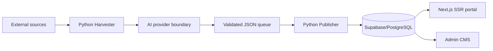

# Little Mere News

[](README.md)
[](README.pt-br.md)

Little Mere News is a bilingual technology-news platform that combines a Next.js portal and CMS, a Python ingestion/processing pipeline, Supabase/PostgreSQL, and an Ollama-compatible AI provider boundary for Harvester article generation. The documented Ollama topology is local by default, but the provider endpoint is configurable. Frontend operation, builds, CI, deterministic tests, and clean-room verification do not require AI/Ollama; the normal Harvester article-generation path does require a valid AI response to produce a new article payload.

## Architecture


```mermaid
flowchart LR
  S[External sources] --> H[Python Harvester]
  H --> A[AI provider boundary]
  A --> Q[Validated JSON queue]
  Q --> P[Python Publisher]
  P --> DB[(Supabase/PostgreSQL)]
  DB --> W[Next.js SSR portal]
  DB --> C[Admin CMS]
```

The repository contains:

- `frontend-web/` — Next.js App Router portal and administrative CMS;
- `Backend-Harvester/` — RSS/Atom feed ingestion and AI-backed article generation;
- `Backend-Publisher/` — validated, retry-safe publishing to Supabase;
- `supabase/migrations/` — versioned database schema, constraints and RLS policies;
- `supabase/tests/` — deterministic PostgreSQL security/contract tests;
- `Infrastructure/` — optional Hyper-V/local orchestration scripts;
- `.github/workflows/ci.yml` — frontend, Python, PostgreSQL and blocking frontend dependency quality gates;
- `.github/workflows/browser-e2e.yml` — deterministic Chromium E2E and accessibility regressions;
- `.github/workflows/security.yml` — Python dependency and committed-secret verification;
- `.github/workflows/codeql.yml` — static analysis for JavaScript/TypeScript and Python.

## Content pipeline

The current data flow is:

`configured RSS/Atom feeds → bounded feed fetch/parse → freshness/source validation → feed-summary normalization → AI generation → structured-output validation → durable Harvester queue → Publisher → Supabase/PostgreSQL → frontend`

The Harvester processes configured feed data; it does not download full publisher article pages. Each Harvester invocation performs a finite batch pass. The repository does not version a continuous polling loop or an ingestion scheduler: the 24-hour window is a freshness filter, `Infrastructure/Run-LMN-Batch.ps1` is a batch orchestrator, and frontend revalidation is not an ingestion cadence.

Normal Harvester article generation has no raw-content or non-AI generation fallback. `OLLAMA_API_URL` is configurable, so "local AI" describes the default deployment convention rather than an architectural guarantee that inference remains local. AI output can contain factual errors or hallucinations, omit context, or drift during paraphrase, translation, or localization. Structured-output validation checks payload structure, not factual accuracy, and the repository does not implement independent fact-checking. Feed excerpts or truncation can further limit context; the original source remains the reference for complete context.

External source content is treated as untrusted and mutable. Critical tests use deterministic fixtures instead of requiring live feeds. AI output is structurally validated before it can enter the publish path, and publisher retries preserve failed items instead of deleting the only copy after a partial failure.

## Security model

Security does **not** depend on a secret URL.

The project uses three separate controls:

1. **Supabase Auth** establishes the authenticated user session.
2. **Server-side authorization** requires explicit membership in `public.admin_users` before dashboard access or privileged server actions are allowed.
3. **PostgreSQL Row Level Security (RLS)** independently restricts browser-facing writes to authenticated users whose `auth.uid()` is present in `public.admin_users`.

`ADMIN_PHANTOM_PATH` only changes the administrative URL. It may reduce trivial bot/scanner noise, but it is **not authentication, authorization, or a security boundary**. The application must remain secure if that path becomes public.

The local publisher uses a server-side Supabase credential. Service-role credentials must never be exposed to browser code, public environment variables, screenshots, CI logs, or committed files.

### Database contract

Database state is versioned in GitHub under `supabase/migrations/`.

Current security and integrity guarantees include:

- public `SELECT` access to `news` for `anon` and `authenticated` roles;
- `INSERT`, `UPDATE`, and `DELETE` on `news` allowed through RLS only for users listed in `admin_users`;
- ordinary authenticated users cannot create their own admin membership;
- `news.source_url` is unique, providing the durable idempotency contract used by the publisher.

The deterministic SQL contract in `supabase/tests/rls_contract.sql` exercises anonymous, ordinary authenticated, and administrator behavior against a disposable PostgreSQL instance.

## CI and tests

GitHub Actions runs independent gates for:

- frontend dependency audits, lint, TypeScript typecheck, and production build;
- deterministic Harvester tests;
- deterministic Publisher tests;
- PostgreSQL migration/RLS contract tests;
- Chromium browser E2E for locale handling, public failure states, unauthenticated routing, ordinary-user authorization denial, and administrator access;
- browser accessibility regressions for labels, keyboard navigation, dialog semantics, focus restoration, and representative structural checks;
- Python dependency auditing;
- full-history committed-secret scanning with a pinned/checksummed Gitleaks binary;
- commit-pinned CodeQL analysis for JavaScript/TypeScript and Python.

Browser tests run the production Next.js server against a repository-owned loopback Supabase HTTP fixture. The fixture uses synthetic users and news records only; no production credentials, production Supabase project, live feeds, Ollama, GPU, or Hyper-V environment are required. Failure runs preserve application/fixture logs and a diagnostic screenshot as short-lived GitHub Actions artifacts.

The checked-in frontend package manifests are the audited dependency state. Both production-only and full-tree npm audits are blocking CI checks at high severity or above; a generated candidate is never treated as a passing security claim until its manifests are committed.

See [`docs/testing.md`](docs/testing.md) for deterministic test execution and [`docs/deployment.md`](docs/deployment.md) for the deploy/runtime and clean-room contract.

## Local setup

### Frontend

```bash
cd frontend-web
npm ci
cp .env.example .env.local
npm run dev
```

Configure the Supabase public URL/key and `ADMIN_PHANTOM_PATH` in `.env.local`. Do not place a service-role key in browser-exposed variables. The frontend-specific environment, production build/start, healthcheck and E2E commands are documented in [`frontend-web/README.md`](frontend-web/README.md).

### Python services

Each Python service owns its dependencies. For deterministic development/testing, use the repository test requirements and fixtures rather than live external infrastructure where possible.

### Database

Apply the SQL files in `supabase/migrations/` in filename order. The repository CI validates the same migration chain against PostgreSQL before exercising the RLS contract.

To grant administrative access in an environment, insert the intended authenticated user's UUID into `public.admin_users` using a trusted administrative/database channel. Do not expose a client-side self-enrollment path.

### Optional local infrastructure

`Infrastructure/` contains the original Windows/Hyper-V orchestration for the local Harvester/Brain/Publisher topology. It remains a supported deployment option, not a prerequisite for building or testing the repository. The local Ollama topology is also a deployment option; the Harvester provider endpoint itself is configurable.

## Deployment and clean-room verification

Deployment is intentionally componentized: the Next.js frontend, Supabase/PostgreSQL, Harvester, Publisher, AI provider boundary and optional Hyper-V/local Ollama topology have distinct runtime boundaries. A clean-room validation must start from a fresh checkout, apply the documented environment and database contract, build/start the production frontend, verify `/api/health` as **Next.js process liveness only**, and then run the deterministic test suites. Provider readiness and external-feed availability require separate smoke checks.

See [`docs/deployment.md`](docs/deployment.md) for the authoritative runbook and residual operational limitations.

## UI evidence

The lightweight static evidence below replaces the former 20+ MB animated walkthrough while preserving representative public and administrative views.

| Public portal | Administrative dashboard |
| :---: | :---: |
|  |  |

| Login | CMS article management |
| :---: | :---: |
|  |  |

## Operational limitations

- External publishers and feeds can change metadata, availability, or rate behavior without notice.
- Normal Harvester content generation requires a valid AI response. AI/Ollama is not required for the frontend, build, CI, deterministic tests, or clean-room verification, and `OLLAMA_API_URL` makes inference locality deployment-dependent.
- Harvester executions are finite batches. No scheduler or continuous polling loop is versioned in this repository, and the freshness window must not be interpreted as ingestion cadence.
- AI output can contain errors, hallucinations, omissions, or paraphrase/translation/localization drift; structural validation is not factual verification and no independent fact-checking is implemented.
- The browser Supabase fixture is a deterministic contract double, not a replacement for a production-environment smoke test.
- Dependency scanners depend on upstream advisory data and cannot prove the absence of undisclosed or not-yet-published vulnerabilities.
- Production Supabase migrations must be reviewed against existing data before deployment; the uniqueness migration intentionally does not silently delete duplicate records.
- Hyper-V orchestration is environment-specific and should not be treated as the only supported development path.

## License

The repository uses the standard MIT License for the software and original project materials to the extent applicable. That license does **not** relicense publisher articles, third-party feed content, third-party trademarks or logos, or external editorial material. Source-specific rights remain subject to the respective terms and rightsholders; consuming an RSS/Atom feed is not, by itself, a statement about republication permission or infringement.

See [LICENSE](LICENSE) for the repository's software licensing terms.
