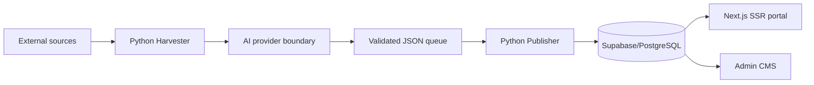

# Little Mere News

[](README.md)
[](README.pt-br.md)

Little Mere News is a bilingual technology-news platform that combines a Next.js portal and CMS, a Python ingestion/processing pipeline, Supabase/PostgreSQL, and optional local AI inference through Ollama. The project is designed as a hybrid local/cloud system while keeping its critical test path independent from domestic GPU, Hyper-V, Ollama, live feeds, and a production Supabase project.

## Architecture


```mermaid
flowchart LR
  S[External sources] --> H[Python Harvester]
  H --> A[AI provider boundary]
  A --> Q[Validated JSON queue]
  Q --> P[Python Publisher]
  P --> DB[(Supabase/PostgreSQL)]
  DB --> W[Next.js SSR portal]
  DB --> C[Admin CMS]
```

The repository contains:

- `frontend-web/` — Next.js App Router portal and administrative CMS;
- `Backend-Harvester/` — source ingestion and local AI processing;
- `Backend-Publisher/` — validated, retry-safe publishing to Supabase;
- `supabase/migrations/` — versioned database schema, constraints and RLS policies;
- `supabase/tests/` — deterministic PostgreSQL security/contract tests;
- `Infrastructure/` — optional Hyper-V/local orchestration scripts;
- `.github/workflows/ci.yml` — frontend, Python, PostgreSQL and blocking frontend dependency quality gates;
- `.github/workflows/browser-e2e.yml` — deterministic Chromium E2E and accessibility regressions;
- `.github/workflows/security.yml` — Python dependency and committed-secret verification;
- `.github/workflows/codeql.yml` — static analysis for JavaScript/TypeScript and Python.

## Content pipeline

The intended data flow is:

`source → scrape/parse → normalize → AI/process → validate → persist queue → publish → frontend`

External source content is treated as untrusted and mutable. Critical tests use deterministic fixtures instead of requiring live feeds. AI output is validated before it can enter the publish path, and publisher retries preserve failed items instead of deleting the only copy after a partial failure.

## Security model

Security does **not** depend on a secret URL.

The project uses three separate controls:

1. **Supabase Auth** establishes the authenticated user session.
2. **Server-side authorization** requires explicit membership in `public.admin_users` before dashboard access or privileged server actions are allowed.
3. **PostgreSQL Row Level Security (RLS)** independently restricts browser-facing writes to authenticated users whose `auth.uid()` is present in `public.admin_users`.

`ADMIN_PHANTOM_PATH` only changes the administrative URL. It may reduce trivial bot/scanner noise, but it is **not authentication, authorization, or a security boundary**. The application must remain secure if that path becomes public.

The local publisher uses a server-side Supabase credential. Service-role credentials must never be exposed to browser code, public environment variables, screenshots, CI logs, or committed files.

### Database contract

Database state is versioned in GitHub under `supabase/migrations/`.

Current security and integrity guarantees include:

- public `SELECT` access to `news` for `anon` and `authenticated` roles;
- `INSERT`, `UPDATE`, and `DELETE` on `news` allowed through RLS only for users listed in `admin_users`;
- ordinary authenticated users cannot create their own admin membership;
- `news.source_url` is unique, providing the durable idempotency contract used by the publisher.

The deterministic SQL contract in `supabase/tests/rls_contract.sql` exercises anonymous, ordinary authenticated, and administrator behavior against a disposable PostgreSQL instance.

## CI and tests

GitHub Actions runs independent gates for:

- frontend dependency audits, lint, TypeScript typecheck, and production build;
- deterministic Harvester tests;
- deterministic Publisher tests;
- PostgreSQL migration/RLS contract tests;
- Chromium browser E2E for locale handling, public failure states, unauthenticated routing, ordinary-user authorization denial, and administrator access;
- browser accessibility regressions for labels, keyboard navigation, dialog semantics, focus restoration, and representative structural checks;
- Python dependency auditing;
- full-history committed-secret scanning with a pinned/checksummed Gitleaks binary;
- commit-pinned CodeQL analysis for JavaScript/TypeScript and Python.

Browser tests run the production Next.js server against a repository-owned loopback Supabase HTTP fixture. The fixture uses synthetic users and news records only; no production credentials, production Supabase project, live feeds, Ollama, GPU, or Hyper-V environment are required. Failure runs preserve application/fixture logs and a diagnostic screenshot as short-lived GitHub Actions artifacts.

The checked-in frontend package manifests are the audited dependency state. Both production-only and full-tree npm audits are blocking CI checks at high severity or above; a generated candidate is never treated as a passing security claim until its manifests are committed.

See [`docs/testing.md`](docs/testing.md) for deterministic local execution and test-boundary details.

## Local setup

### Frontend

```bash
cd frontend-web
npm ci
cp .env.example .env.local
npm run dev
```

Configure the Supabase public URL/key and `ADMIN_PHANTOM_PATH` in `.env.local`. Do not place a service-role key in browser-exposed variables.

### Python services

Each Python service owns its dependencies. For deterministic development/testing, use the repository test requirements and fixtures rather than live external infrastructure where possible.

### Database

Apply the SQL files in `supabase/migrations/` in filename order. The repository CI validates the same migration chain against PostgreSQL before exercising the RLS contract.

To grant administrative access in an environment, insert the intended authenticated user's UUID into `public.admin_users` using a trusted administrative/database channel. Do not expose a client-side self-enrollment path.

### Optional local infrastructure

`Infrastructure/` contains the original Windows/Hyper-V orchestration for the local Harvester/Brain/Publisher topology. It remains a supported deployment option, not a prerequisite for building or testing the repository.

## UI evidence

<p align="center">
  
</p>

| Public portal | Administrative dashboard |
| :---: | :---: |
|  |  |

| Login | CMS article management |
| :---: | :---: |
|  |  |

## Operational limitations

- External publishers and feeds can change markup, metadata, availability, or rate behavior without notice.
- Local Ollama inference is optional for the production pipeline but deliberately excluded from deterministic CI.
- The browser Supabase fixture is a deterministic contract double, not a replacement for a production-environment smoke test.
- Dependency scanners depend on upstream advisory data and cannot prove the absence of undisclosed or not-yet-published vulnerabilities.
- Production Supabase migrations must be reviewed against existing data before deployment; the uniqueness migration intentionally does not silently delete duplicate records.
- Hyper-V orchestration is environment-specific and should not be treated as the only supported development path.

## License

See [LICENSE](LICENSE) for the repository's licensing terms.
