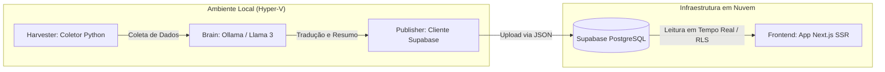

# Little Mere News

[](https://github.com/Gyliardson/little-mere-news/blob/main/README.md)
[](https://github.com/Gyliardson/little-mere-news/blob/main/README.pt-br.md)

Uma plataforma automatizada e bilíngue de notícias de tecnologia, utilizando Inteligência Artificial Local (LLMs) e processamento em lote sob demanda para minimizar os custos operacionais na nuvem.


## Arquitetura do Sistema

O Little Mere News emprega um padrão de **Processamento em Lote (Batch)** combinado com uma infraestrutura híbrida (Local + Nuvem). Em vez de pagar por GPUs caras na nuvem rodando 24 horas por dia, todas as tarefas de alto processamento (Web Scraping e Inferência de IA) são executadas localmente em um cluster Hyper-V isolado.

### Infraestrutura Local e Pipeline de IA

Este cluster é provisionado automaticamente e ligado sob demanda através de um orquestrador PowerShell. Ele processa as notícias do dia, faz o upload dos dados formatados para a nuvem, e logo em seguida desliga os servidores virtuais para poupar os recursos de hardware local.



### Frontend e Painel Administrativo

O frontend foi construído com Next.js utilizando o App Router, contando com Server-Side Rendering (SSR) para otimização de SEO e performance. O sistema inclui um Content Management System (CMS) totalmente funcional, feito sob medida para a administração do corpus de notícias.

#### Segurança de Defesa em Profundidade (Defense-in-Depth)

O painel de administração baseia-se em um modelo de segurança em camadas:

1. **A "Rota Fantasma" (Ofuscação):** O painel administrativo não é acessível por meio de uma URL padrão como `/admin`. Em vez disso, ele utiliza um parâmetro de rota dinâmico `[secret_admin]`, preenchido por uma variável de ambiente (`ADMIN_PHANTOM_PATH`). Isso atua como uma mitigação inicial contra scanners automáticos de vulnerabilidade e bots de força bruta, reduzindo drasticamente o ruído no servidor.
2. **Autenticação SSR (Verificação Criptográfica):** A segurança central é garantida pelo Supabase Auth integrado diretamente aos middleware e server components do Next.js. Mesmo que a "Rota Fantasma" seja descoberta, o acesso não autorizado é completamente bloqueado no nível do servidor; nenhum dado sensível é transmitido a um cliente não autenticado.
3. **Row Level Security - RLS (Segurança em Nível de Linha):** A integridade dos dados é aplicada na camada de banco de dados (veja o Manual Técnico do Supabase abaixo).

#### Funcionalidades do CMS

O painel fornece métricas em tempo real e recursos completos de CRUD por meio de interfaces modais modernas e acessíveis. Os recursos incluem:
* **Dashboard Interativo:** Visualização em tempo real do volume processado e das fontes ativas.
* **Edição Inline:** Aprovação rápida e modificação de artigos gerados por IA usando gerenciamento de estado sincronizado.
* **Internacionalização (i18n):** Tanto o portal público quanto o painel administrativo são totalmente localizados em Inglês e Português.

#### Tabela de Estrutura de Rotas

| Padrão da Rota | Nível de Acesso | Descrição |
| :--- | :--- | :--- |
| `/[lang]` | Público | Portal principal localizado (Home). |
| `/[lang]/news/[slug]` | Público | Visão detalhada de um artigo específico. |
| `/[lang]/[secret_admin]/login` | Não Autenticado | Ponto de entrada para adquirir uma sessão do Supabase. |
| `/[lang]/[secret_admin]/(dashboard)` | **Administrador Autenticado** | Visão geral do CMS protegido e gráficos de métricas. |
| `/[lang]/[secret_admin]/(dashboard)/news` | **Administrador Autenticado** | Rota protegida para edição e gerenciamento de artigos. |

## Interface do Usuário e Funcionalidades

<p align="center">
  
  <br>
  <em>Figura 1: Demonstração abrangente ilustrando o processo de autenticação, visão geral do dashboard e fluxo de gerenciamento de notícias.</em>
</p>

### Portal Público vs. Dashboard Administrativo

| Portal Público (Home) | Dashboard Administrativo |
| :---: | :---: |
|  |  |
| <em>Figura 2: O portal público bilíngue exibindo notícias de tecnologia agregadas.</em> | <em>Figura 3: Dashboard Administrativo ilustrando métricas em tempo real da agregação de notícias no servidor.</em> |

### Gerenciamento de Conteúdo e Autenticação

| Interface de Login Seguro | Gerenciamento de Artigos do CMS |
| :---: | :---: |
|  |  |
| <em>Figura 4: A interface de login autenticada via Rota Fantasma utilizando Supabase SSR.</em> | <em>Figura 5: Visualização em lista do CMS fornecendo status em tempo real e ações rápidas para os artigos.</em> |

| Menu de Ações do CMS | Visualização Detalhada do Artigo |
| :---: | :---: |
|  |  |
| <em>Figura 6: Menu de ações contextuais facilitando modificações eficientes e transições de estado do conteúdo.</em> | <em>Figura 7: Visualização detalhada do artigo renderizada no lado do servidor (SSR) garantindo desempenho ideal de SEO.</em> |

## Estrutura do Repositório

O projeto é modularizado para refletir sua arquitetura de microsserviços:

* `/Infrastructure`: Scripts Bash e PowerShell idempotentes usados para provisionar o ambiente Hyper-V e o Orquestrador. Os scripts foram padronizados para o Inglês.
* `/Backend-Harvester`: Código Python responsável por ler feeds RSS e APIs de sites de tecnologia para extrair os artigos originais.
* `/Backend-Publisher`: Código Python que recebe o texto processado e realiza a inserção segura (Upsert) nas tabelas relacionais do Supabase.
* `/Frontend-Web`: A interface de usuário e aplicação SSR hospedada no Render, consumindo os dados diretamente da API do Supabase.

## Setup e Configuração

Este projeto depende de variáveis de ambiente tanto para a infraestrutura local quanto para o frontend hospedado na nuvem.

### 1. Infraestrutura Raiz (.env)
Usado pelo PowerShell e scripts Python para comunicar com o Supabase.
1. Copie o arquivo `.env.example` para `.env`.
2. Preencha seu `SUPABASE_URL` e `SUPABASE_KEY` (service_role).

### 2. Frontend Web (.env.local)
Usado pela aplicação Next.js.
1. Navegue até a pasta `/frontend-web`.
2. Copie o arquivo `.env.example` para `.env.local`.
3. Preencha as chaves públicas e privadas, incluindo a variável `ADMIN_PHANTOM_PATH`.

### 3. Manual Técnico do Supabase (Keys e RLS)

Para garantir que o modelo de segurança funcione corretamente em novas implantações, o banco de dados PostgreSQL do Supabase deve ser configurado com Row Level Security (RLS).

**Configuração de Melhores Práticas:**
1. **Habilitar RLS:** Navegue até a aba Authentication -> Policies no painel do seu Supabase e habilite o RLS na tabela `news`.
2. **Acesso Público de Leitura:** Crie uma política permitindo operações de `SELECT` para a role `anon` (anônimo). Isso permite que as rotas públicas do Next.js busquem os artigos.
    ```sql
    -- Exemplo de Política: "Permitir acesso público de leitura"
    CREATE POLICY "Allow public read access" ON "public"."news"
    FOR SELECT USING (true);
    ```
3. **Acesso Administrativo de Escrita:** Crie políticas para `INSERT`, `UPDATE` e `DELETE` que sejam estritamente restritas à role `authenticated` (e, opcionalmente, UUIDs específicos de usuários administradores).
    ```sql
    -- Exemplo de Política: "Permitir atualização por admins"
    CREATE POLICY "Allow admins to update" ON "public"."news"
    FOR UPDATE USING (auth.role() = 'authenticated');
    ```
4. **Service Role (Batch Local):** O `LMN-Publisher` rodando localmente utiliza a chave `service_role`, que contorna (bypassa) inerentemente o RLS para realizar upserts em massa com segurança a partir do ambiente isolado do Hyper-V. **Nunca exponha a chave `service_role` no frontend.**

## Licença

Este projeto é licenciado sob uma Licença MIT Personalizada. Você é livre para usar, modificar e distribuir este software para fins educacionais e pessoais. **O uso comercial é permitido, mas requer estritamente a atribuição visível ao autor original (Gyliardson), tanto no código quanto no produto final.**

*Aviso: O autor não se responsabiliza por perdas de dados ou danos causados pelo uso deste código. Qualquer disputa legal será julgada exclusivamente em território brasileiro.* Consulte o arquivo [LICENSE](LICENSE) para detalhes completos.

## Contribuição e Padrões do Git

Para manter um histórico de commits limpo e compreensível, este repositório segue um padrão estruturado de mensagens. Todos os próximos commits devem aderir ao seguinte formato:

* `[Versão] | Feature | Descrição` (Para novas funcionalidades)
* `[Versão] | Fix | Descrição` (Para correções de bugs)
* `[Versão] | Docs | Descrição` (Para atualizações de documentação)
* `[Versão] | Refactor | Descrição` (Para refatorações de código sem impacto visual)

**Exemplo:**
`v1.0.1 | Fix | Resolve o problema com a paginação no painel administrativo`
