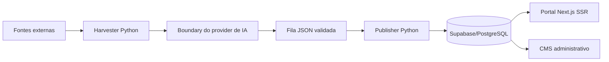

# Little Mere News

[](README.md)
[](README.pt-br.md)

Little Mere News é uma plataforma bilíngue de notícias de tecnologia que combina um portal e CMS em Next.js, um pipeline Python de ingestão/processamento, Supabase/PostgreSQL e inferência opcional de IA local via Ollama. O projeto mantém uma arquitetura híbrida local/nuvem, mas seu caminho crítico de testes não depende de GPU doméstica, Hyper-V, Ollama, feeds reais ou de um projeto Supabase de produção.

## Arquitetura


```mermaid
flowchart LR
  S[Fontes externas] --> H[Harvester Python]
  H --> A[Boundary do provider de IA]
  A --> Q[Fila JSON validada]
  Q --> P[Publisher Python]
  P --> DB[(Supabase/PostgreSQL)]
  DB --> W[Portal Next.js SSR]
  DB --> C[CMS administrativo]
```

O repositório contém:

- `frontend-web/` — portal Next.js App Router e CMS administrativo;
- `Backend-Harvester/` — ingestão de fontes e processamento com IA local;
- `Backend-Publisher/` — publicação validada e resiliente a retries no Supabase;
- `supabase/migrations/` — schema, constraints e policies RLS versionados;
- `supabase/tests/` — testes determinísticos do contrato de segurança em PostgreSQL;
- `Infrastructure/` — scripts opcionais de orquestração Hyper-V/local;
- `.github/workflows/ci.yml` — gates de CI que não dependem da infraestrutura local.

## Pipeline de conteúdo

Fluxo pretendido:

`source → scrape/parse → normalize → AI/process → validate → persist queue → publish → frontend`

Conteúdo vindo de fontes externas é tratado como não confiável e mutável. Os testes críticos usam fixtures determinísticas em vez de depender de feeds reais. A saída da IA é validada antes de entrar no caminho de publicação, e falhas parciais do publisher preservam os itens pendentes para retry em vez de apagar a única cópia.

## Modelo de segurança

A segurança **não depende de uma URL secreta**.

O projeto usa três controles separados:

1. **Supabase Auth** estabelece a sessão autenticada.
2. **Autorização server-side** exige membership explícita em `public.admin_users` antes de liberar dashboard ou server actions privilegiadas.
3. **PostgreSQL Row Level Security (RLS)** restringe de forma independente as escritas expostas ao browser aos usuários autenticados cujo `auth.uid()` exista em `public.admin_users`.

`ADMIN_PHANTOM_PATH` apenas altera a URL administrativa. Ele pode reduzir ruído de bots/scanners triviais, mas **não é autenticação, autorização nem uma fronteira de segurança**. A aplicação deve continuar segura mesmo que esse caminho se torne público.

O publisher local usa uma credencial Supabase server-side. Credenciais `service_role` nunca devem aparecer em código de browser, variáveis públicas, screenshots, logs de CI ou arquivos versionados.

### Contrato de banco

O estado do banco é versionado em `supabase/migrations/`.

As garantias atuais incluem:

- `SELECT` público em `news` para as roles `anon` e `authenticated`;
- `INSERT`, `UPDATE` e `DELETE` em `news` permitidos via RLS somente a usuários presentes em `admin_users`;
- usuários autenticados comuns não podem criar a própria membership administrativa;
- `news.source_url` é único, fornecendo o contrato durável de idempotência usado pelo publisher.

O teste `supabase/tests/rls_contract.sql` exercita os comportamentos de anônimo, usuário autenticado comum e administrador contra uma instância PostgreSQL descartável.

## CI e testes

O GitHub Actions executa gates independentes para:

- lint do frontend, typecheck TypeScript e build de produção;
- testes determinísticos do Harvester;
- testes determinísticos do Publisher;
- migrations PostgreSQL e contrato RLS.

O caminho crítico de CI deliberadamente não exige Ollama, GPU, Hyper-V, credenciais de produção do Supabase ou fontes reais de notícias.

## Setup local

### Frontend

```bash
cd frontend-web
npm ci
cp .env.example .env.local
npm run dev
```

Configure a URL/chave pública do Supabase e `ADMIN_PHANTOM_PATH` em `.env.local`. Não coloque uma chave `service_role` em variáveis expostas ao browser.

### Serviços Python

Cada serviço Python possui suas próprias dependências. Para desenvolvimento/teste determinístico, prefira os requirements de teste e fixtures do repositório em vez de infraestrutura externa real.

### Banco de dados

Aplique os arquivos de `supabase/migrations/` na ordem dos nomes. A CI valida a mesma cadeia de migrations em PostgreSQL antes de executar o contrato RLS.

Para conceder acesso administrativo, insira o UUID do usuário autenticado desejado em `public.admin_users` usando um canal administrativo/de banco confiável. Não exponha um fluxo client-side de autoinscrição administrativa.

### Infraestrutura local opcional

`Infrastructure/` contém a orquestração original Windows/Hyper-V para a topologia local Harvester/Brain/Publisher. Ela continua sendo uma opção de deploy, não um pré-requisito para build ou testes do repositório.

## Evidência visual

<p align="center">
  
</p>

| Portal público | Dashboard administrativo |
| :---: | :---: |
|  |  |

| Login | Gerenciamento de artigos |
| :---: | :---: |
|  |  |

## Limitações operacionais

- Fontes externas podem mudar markup, metadata, disponibilidade ou comportamento de rate limit sem aviso.
- A inferência local via Ollama é opcional no pipeline de produção e deliberadamente excluída da CI determinística.
- Migrations de produção do Supabase devem ser revisadas contra os dados existentes antes do deploy; a migration de unicidade não remove duplicatas silenciosamente.
- A orquestração Hyper-V é específica de ambiente e não deve ser tratada como o único caminho suportado de desenvolvimento.

## Licença

Consulte [LICENSE](LICENSE) para os termos de licenciamento do repositório.
