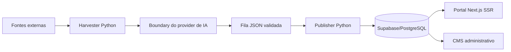

# Little Mere News

[](README.md)
[](README.pt-br.md)

Little Mere News é uma plataforma bilíngue de notícias de tecnologia que combina um portal e CMS em Next.js, um pipeline Python de ingestão/processamento, Supabase/PostgreSQL e uma fronteira de provider de IA compatível com Ollama para a geração de artigos do Harvester. A topologia documentada com Ollama é local por padrão, mas o endpoint do provider é configurável. Frontend, builds, CI, testes determinísticos e verificação clean-room não exigem IA/Ollama; o caminho normal de geração de artigos do Harvester exige uma resposta válida de IA para produzir um novo payload de artigo.

## Arquitetura


```mermaid
flowchart LR
  S[Fontes externas] --> H[Harvester Python]
  H --> A[Boundary do provider de IA]
  A --> Q[Fila JSON validada]
  Q --> P[Publisher Python]
  P --> DB[(Supabase/PostgreSQL)]
  DB --> W[Portal Next.js SSR]
  DB --> C[CMS administrativo]
```

O repositório contém:

- `frontend-web/` — portal Next.js App Router e CMS administrativo;
- `Backend-Harvester/` — ingestão de feeds RSS/Atom e geração de artigos com IA;
- `Backend-Publisher/` — publicação validada e resiliente a retries no Supabase;
- `supabase/migrations/` — schema, constraints e policies RLS versionados;
- `supabase/tests/` — testes determinísticos do contrato de segurança em PostgreSQL;
- `Infrastructure/` — scripts opcionais de orquestração Hyper-V/local;
- `.github/workflows/ci.yml` — gates de frontend, Python, PostgreSQL e auditoria bloqueante das dependências do frontend;
- `.github/workflows/browser-e2e.yml` — regressões determinísticas de E2E e acessibilidade em Chromium;
- `.github/workflows/security.yml` — auditoria de dependências Python e verificação de secrets commitados;
- `.github/workflows/codeql.yml` — análise estática de JavaScript/TypeScript e Python.

## Pipeline de conteúdo

O fluxo atual é:

`feeds RSS/Atom configurados → fetch/parse limitado do feed → validação de freshness/source → normalização do resumo do feed → geração por IA → validação de saída estruturada → fila durável do Harvester → Publisher → Supabase/PostgreSQL → frontend`

O Harvester processa os dados dos feeds configurados; ele não baixa as páginas completas dos artigos dos publishers. Cada execução do Harvester realiza um batch finito. O repositório não versiona um loop de polling contínuo nem um scheduler de ingestão: a janela de 24 horas é um filtro de freshness, `Infrastructure/Run-LMN-Batch.ps1` é um orquestrador de batch e o revalidate do frontend não define a cadência de ingestão.

A geração normal de artigos do Harvester não possui fallback de conteúdo bruto nem fallback de geração sem IA. `OLLAMA_API_URL` é configurável, portanto "IA local" descreve a convenção padrão de deploy e não uma garantia arquitetural de que a inferência permanecerá local. A saída da IA pode conter erros factuais ou hallucinations, omitir contexto ou sofrer drift de paráfrase, tradução ou localização. A validação de saída estruturada verifica a estrutura do payload, não a exatidão factual, e o repositório não implementa fact-checking independente. Excertos ou truncamento dos feeds também podem limitar o contexto; a fonte original continua sendo a referência para o contexto completo.

Conteúdo vindo de fontes externas é tratado como não confiável e mutável. Os testes críticos usam fixtures determinísticas em vez de depender de feeds reais. A saída da IA é validada estruturalmente antes de entrar no caminho de publicação, e falhas parciais do publisher preservam os itens pendentes para retry em vez de apagar a única cópia.

## Modelo de segurança

A segurança **não depende de uma URL secreta**.

O projeto usa três controles separados:

1. **Supabase Auth** estabelece a sessão autenticada.
2. **Autorização server-side** exige membership explícita em `public.admin_users` antes de liberar dashboard ou server actions privilegiadas.
3. **PostgreSQL Row Level Security (RLS)** restringe de forma independente as escritas expostas ao browser aos usuários autenticados cujo `auth.uid()` exista em `public.admin_users`.

`ADMIN_PHANTOM_PATH` apenas altera a URL administrativa. Ele pode reduzir ruído de bots/scanners triviais, mas **não é autenticação, autorização nem uma fronteira de segurança**. A aplicação deve continuar segura mesmo que esse caminho se torne público.

O publisher local usa uma credencial Supabase server-side. Credenciais `service_role` nunca devem aparecer em código de browser, variáveis públicas, screenshots, logs de CI ou arquivos versionados.

### Contrato de banco

O estado do banco é versionado em `supabase/migrations/`.

As garantias atuais incluem:

- `SELECT` público em `news` para as roles `anon` e `authenticated`;
- `INSERT`, `UPDATE` e `DELETE` em `news` permitidos via RLS somente a usuários presentes em `admin_users`;
- usuários autenticados comuns não podem criar a própria membership administrativa;
- `news.source_url` é único, fornecendo o contrato durável de idempotência usado pelo publisher.

O teste `supabase/tests/rls_contract.sql` exercita os comportamentos de anônimo, usuário autenticado comum e administrador contra uma instância PostgreSQL descartável.

## CI e testes

O GitHub Actions executa gates independentes para:

- auditorias de dependências do frontend, lint, typecheck TypeScript e build de produção;
- testes determinísticos do Harvester;
- testes determinísticos do Publisher;
- migrations PostgreSQL e contrato RLS;
- E2E em Chromium para locale inválido, estado público de falha, rota administrativa sem sessão, negação de usuário autenticado comum e acesso de administrador;
- regressões de acessibilidade em browser para labels, navegação por teclado, semântica de diálogo, restauração de foco e verificações estruturais representativas;
- auditoria de dependências Python;
- varredura do histórico Git completo para secrets commitados usando um binário Gitleaks fixado e verificado por checksum;
- CodeQL fixado por commit para JavaScript/TypeScript e Python.

Os testes de browser sobem o servidor Next.js de produção contra um fixture HTTP local de Supabase pertencente ao repositório. O fixture usa apenas usuários e notícias sintéticos; não requer credenciais de produção, projeto Supabase real, feeds externos, Ollama, GPU ou Hyper-V. Em falhas, logs da aplicação/fixture e uma captura diagnóstica são preservados temporariamente como artifacts do GitHub Actions.

Os manifests versionados do frontend representam o estado de dependências auditado. Tanto o audit apenas de produção quanto o audit da árvore completa são gates bloqueantes da CI para severidade high ou superior; um candidato gerado nunca é tratado como evidência de segurança até seus manifests serem commitados.

Consulte [`docs/testing.md`](docs/testing.md) para execução determinística dos testes e [`docs/deployment.md`](docs/deployment.md) para o contrato de deploy/runtime e clean-room.

## Setup local

### Frontend

```bash
cd frontend-web
npm ci
cp .env.example .env.local
npm run dev
```

Configure a URL/chave pública do Supabase e `ADMIN_PHANTOM_PATH` em `.env.local`. Não coloque uma chave `service_role` em variáveis expostas ao browser. O contrato específico de ambiente, build/start de produção, healthcheck e E2E do frontend está em [`frontend-web/README.md`](frontend-web/README.md).

### Serviços Python

Cada serviço Python possui suas próprias dependências. Para desenvolvimento/teste determinístico, prefira os requirements de teste e fixtures do repositório em vez de infraestrutura externa real.

### Banco de dados

Aplique os arquivos de `supabase/migrations/` na ordem dos nomes. A CI valida a mesma cadeia de migrations em PostgreSQL antes de executar o contrato RLS.

Para conceder acesso administrativo, insira o UUID do usuário autenticado desejado em `public.admin_users` usando um canal administrativo/de banco confiável. Não exponha um fluxo client-side de autoinscrição administrativa.

### Infraestrutura local opcional

`Infrastructure/` contém a orquestração original Windows/Hyper-V para a topologia local Harvester/Brain/Publisher. Ela continua sendo uma opção de deploy, não um pré-requisito para build ou testes do repositório. A topologia local com Ollama também é uma opção de deploy; o endpoint do provider do Harvester é configurável.

## Deploy e verificação clean-room

O deploy é deliberadamente dividido por componente: frontend Next.js, Supabase/PostgreSQL, Harvester, Publisher, fronteira do provider de IA e topologia opcional Hyper-V/Ollama local possuem fronteiras de runtime distintas. Uma validação clean-room deve começar de um checkout novo, aplicar o contrato documentado de ambiente e banco, buildar/iniciar o frontend de produção, verificar `/api/health` apenas como **liveness do processo Next.js** e então executar as suítes determinísticas. Readiness do provider e disponibilidade dos feeds externos exigem smoke checks separados.

Consulte [`docs/deployment.md`](docs/deployment.md) para o runbook autoritativo e as limitações operacionais residuais.

## Evidência visual

A evidência estática leve abaixo substitui a antiga demonstração animada de mais de 20 MB, preservando visões representativas das superfícies pública e administrativa.

| Portal público | Dashboard administrativo |
| :---: | :---: |
|  |  |

| Login | Gerenciamento de artigos |
| :---: | :---: |
|  |  |

## Limitações operacionais

- Publishers externos e feeds podem mudar metadata, disponibilidade ou comportamento de rate limit sem aviso.
- A geração normal de conteúdo do Harvester exige uma resposta válida de IA. IA/Ollama não é necessária para frontend, build, CI, testes determinísticos ou verificação clean-room, e `OLLAMA_API_URL` torna a localidade da inferência dependente do deploy.
- As execuções do Harvester são batches finitos. Nenhum scheduler ou loop de polling contínuo é versionado neste repositório, e a janela de freshness não deve ser interpretada como cadência de ingestão.
- A saída da IA pode conter erros, hallucinations, omissões ou drift de paráfrase/tradução/localização; validação estrutural não é verificação factual e não há fact-checking independente implementado.
- O fixture Supabase de browser é um contract double determinístico, não um substituto para smoke test em ambiente de produção.
- Scanners de dependências dependem de dados de advisory externos e não provam ausência de vulnerabilidades ainda não divulgadas ou não publicadas.
- Migrations de produção do Supabase devem ser revisadas contra os dados existentes antes do deploy; a migration de unicidade não remove duplicatas silenciosamente.
- A orquestração Hyper-V é específica de ambiente e não deve ser tratada como o único caminho suportado de desenvolvimento.

## Licença

O repositório usa a licença MIT padrão para o software e os materiais originais do projeto, na medida aplicável. Essa licença **não** relicencia artigos de publishers, conteúdo de feeds de terceiros, marcas ou logos de terceiros nem material editorial externo. Direitos específicos de cada fonte continuam sujeitos aos respectivos termos e titulares; consumir um feed RSS/Atom não é, por si só, uma declaração sobre permissão de republicação ou infração.

Consulte [LICENSE](LICENSE) para os termos de licenciamento do software do repositório.
