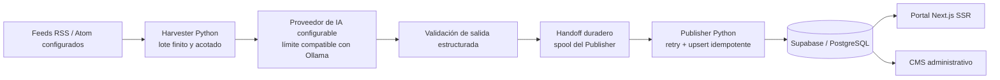

<div align="center">

# Little Mere News

**Un pipeline determinista de noticias tecnológicas con límites explícitos de IA, colas y autorización.**

Little Mere News combina un portal y CMS en Next.js, ingestión finita de RSS/Atom en Python, un límite configurable de proveedor de IA, colas duraderas de publicación y controles de autorización con Supabase/PostgreSQL.

[English](../../../README.md) · [Português](../pt-BR/README.md) · [日本語](../ja/README.md) · [Español](README.md)

[](https://github.com/Gyliardson/little-mere-news/actions/workflows/ci.yml)
[](../../../LICENSE)

</div>

## Descripción general

Little Mere News transforma resúmenes de feeds RSS/Atom configurados en payloads bilingües de artículos en inglés/portugués, valida la estructura generada, transfiere el trabajo mediante colas recuperables después de fallos y publica a través de un límite controlado de Supabase/PostgreSQL para el portal público y el CMS administrativo.

El repositorio separa la ingestión de fuentes, la generación asistida por IA, la publicación, la autorización de base de datos y la entrega del frontend para que cada límite pueda revisarse y probarse de forma independiente.

## ¿Por qué Little Mere News?

| Ingestión determinista de feeds | Límite explícito de IA / editorial | Integridad duradera de publicación |
| --- | --- | --- |
| Fetches RSS/Atom acotados, validación de fuente/frescura, lotes finitos del Harvester y fixtures deterministas mantienen la verificación crítica independiente de feeds reales. | La generación por IA es explícita y configurable; la validación de esquema limita la forma del payload sin afirmar verificación factual. | La identidad inmutable del handoff, los retries/cuarentena acotados y la unicidad de base de datos protegen el trabajo ante crashes, reintentos y replay. |

## Capacidades principales

- portal público de noticias tecnológicas y CMS administrativo con Next.js App Router;
- payloads bilingües inglés/portugués generados a partir de **resúmenes de feeds** RSS/Atom configurados;
- ejecución finita del Harvester con transporte externo acotado y controles de destino orientados a mitigar SSRF;
- límite configurable de proveedor de IA compatible con Ollama para la generación normal de artículos;
- claims duraderos del Harvester y ownership de inbox/processing del Publisher;
- retry acotado del Publisher, cuarentena duradera, idempotencia por `source_url` segura ante replay y upsert;
- Supabase Auth, membership explícita en `public.admin_users`, autorización server-side y PostgreSQL RLS;
- gates deterministas de frontend, Python, PostgreSQL, navegador, dependencias, secret scanning y CodeQL.

## Arquitectura



El Harvester procesa los datos de feeds configurados en lugar de descargar las páginas completas de los artículos de los publishers. El estado y la autorización de la base de datos se versionan en `supabase/`, mientras que la topología opcional Hyper-V/Ollama sigue siendo una opción de despliegue y no un requisito arquitectónico.

## Pipeline de contenido

`feeds RSS/Atom configurados → fetch/parse acotado → validación de frescura/fuente → normalización del resumen del feed → generación por IA → validación de salida estructurada → handoff duradero del Harvester → spool/retry del Publisher → Supabase/PostgreSQL → frontend`

Cada invocación del Harvester es un **lote finito**. El repositorio no versiona un loop de polling continuo ni un scheduler de ingestión. El valor de 24 horas es una ventana de frescura, `Infrastructure/Run-LMN-Batch.ps1` es un orquestador explícito de lotes y la revalidación del frontend no define la cadencia de ingestión.

## Aspectos técnicos destacados

- **Ingestión basada en el resumen del feed.** La generación normal usa el texto normalizado de `summary` de la entrada RSS/Atom y URLs de fuente duraderas; no obtiene la página completa del artículo del publisher.
- **Límite de IA configurable.** `OLLAMA_API_URL` selecciona el endpoint del proveedor. Ollama local es la convención de despliegue predeterminada documentada, no una garantía arquitectónica de que la inferencia permanezca local.
- **Validación de salida estructurada.** La salida de IA debe satisfacer el contrato esperado de JSON/campos del artículo antes de entrar en la ruta de publicación.
- **Ownership duradero de colas.** Los claims del Harvester y los archivos inbox/processing del Publisher usan identidad específica para que la limpieza no elimine trabajo más nuevo en un pathname anteriormente compartido.
- **Retry acotado e idempotencia.** Los retries del Publisher usan evidencia estructurada de transitoriedad, metadata duradera, cuarentena y unicidad de base de datos en `news.source_url`.
- **Auth + membership administrativa + RLS.** Supabase Auth establece identidad, los checks server-side requieren `public.admin_users` y PostgreSQL RLS restringe de forma independiente las mutaciones expuestas al navegador.
- **CI determinista.** Las pruebas críticas usan fixtures del repositorio y servicios locales/desechables en vez de depender de feeds reales, Supabase de producción, Ollama, GPU o Hyper-V.
- **Límite explícito de scheduling.** No se versiona ningún scheduler ni loop continuo de ingestión; el filtro de frescura no debe describirse como cadencia de ejecución.

## Interfaz

Las capturas representativas propiedad del repositorio se muestran con un ancho legible, en vez de comprimirse en un diseño denso de dos columnas.

### Portal público

<p align="center">
  
</p>

### Dashboard administrativo

<p align="center">
  
</p>

### Login administrativo

<p align="center">
  
</p>

### Gestión de artículos del CMS

<p align="center">
  
</p>

## Límite de IA / editorial

La generación normal de artículos del Harvester requiere una respuesta válida de IA; no existe un fallback de contenido bruto ni un fallback sin IA que cree silenciosamente un artículo normal cuando falla el proveedor.

La salida de IA puede contener errores factuales o hallucinations, omitir contexto o sufrir drift durante paráfrasis, traducción o localización. La validación de salida estructurada verifica la forma del payload, **no la exactitud factual**, y el repositorio no implementa fact-checking independiente. Los extractos de feeds también pueden estar incompletos o truncados. El publisher/fuente original sigue siendo la referencia autoritativa para el contexto completo y el significado editorial.

Como `OLLAMA_API_URL` es configurable, un despliegue local con Ollama es una convención de la topología documentada, no una garantía de que toda inferencia sea local.

## Inicio rápido

### Frontend

```bash
cd frontend-web
npm ci
cp .env.example .env.local
npm run dev
```

Configura los valores públicos de Supabase y `ADMIN_PHANTOM_PATH` en `.env.local`. Mantén `SUPABASE_SERVICE_ROLE_KEY` solo en el servidor y nunca la expongas mediante `NEXT_PUBLIC_*`, código del navegador, capturas, logs o archivos versionados.

Para el contrato de runtime del repositorio, setup de base de datos, workers Python y verificación clean-room, consulta la [documentación de deployment](../../operations/DEPLOYMENT.md). Los comandos deterministas de pruebas locales están en [testing](../../assurance/TESTING.md).

## Calidad y seguridad

La seguridad **no depende** de una URL administrativa difícil de adivinar. `ADMIN_PHANTOM_PATH` es solo oscuridad de URL y no es autenticación, autorización ni un límite de seguridad.

El acceso administrativo se aplica mediante tres capas distintas:

1. Supabase Auth establece la sesión autenticada.
2. La autorización server-side comprueba membership explícita en `public.admin_users`.
3. PostgreSQL RLS restringe de forma independiente las escrituras expuestas al navegador a administradores autenticados.

La CI ejercita calidad de build/tipos del frontend, pruebas deterministas de Harvester y Publisher, contratos de migrations/RLS de PostgreSQL, E2E/accesibilidad en navegador, auditoría de dependencias, committed-secret scanning y CodeQL. Un gate exitoso es evidencia de la propiedad que ejecuta, no una garantía universal de preparación para producción o seguridad.

Consulta [seguridad de red outbound](../../security/OUTBOUND_NETWORK_SECURITY.md) y [testing/assurance](../../assurance/TESTING.md) para los límites detallados.

## Documentación

El [hub de documentación técnica](../../README.md) es el índice canónico para el material de ingeniería detallado.

- [Seguridad — límite de confianza de feeds outbound](../../security/OUTBOUND_NETWORK_SECURITY.md)
- [Fiabilidad — ownership de la cola del Publisher](../../reliability/PUBLISHER_QUEUE_OWNERSHIP.md)
- [Fiabilidad — política de retry del Publisher](../../reliability/PUBLISHER_RETRY_POLICY.md)
- [Operaciones — deployment y contrato de runtime clean-room](../../operations/DEPLOYMENT.md)
- [Assurance — pruebas deterministas](../../assurance/TESTING.md)

La documentación técnica detallada sigue siendo canónica en inglés; la presentación pública del proyecto se mantiene en cuatro idiomas.

## Limitaciones operativas

- Los publishers externos y feeds pueden cambiar metadata, disponibilidad, redirects o comportamiento de rate limit sin aviso.
- La generación normal del Harvester requiere una respuesta válida de IA; la salida de IA no es verdad factual autoritativa.
- Las ejecuciones del Harvester son lotes finitos. No se versiona ningún scheduler ni loop continuo de polling, y la ventana de frescura de 24 horas no es una cadencia de ingestión.
- Los fixtures deterministas y la CI no sustituyen smoke checks específicos del despliegue para Supabase de producción, red, DNS, disponibilidad del proveedor o configuración de plataforma.
- Las migrations de producción deben revisarse contra los datos existentes; la migration de unicidad intencionadamente no elimina duplicados de forma silenciosa.
- La orquestación Hyper-V es opcional y específica del entorno, no el único camino de desarrollo/runtime soportado.

## Licencia / límite de contenido de terceros

El repositorio usa la **Licencia MIT** estándar para el software y los materiales originales del proyecto, en la medida aplicable. La licencia MIT **no relicencia** artículos de publishers, contenido de feeds RSS/Atom de terceros, logos o marcas de terceros ni material editorial externo.

Los derechos sobre contenido externo siguen sujetos a los términos aplicables de cada fuente y a sus respectivos titulares. Consumir o analizar un feed RSS/Atom **no**, por sí mismo, concede derechos de republicación ni establece permiso para reutilizar contenido del publisher.

Consulta [LICENSE](../../../LICENSE) para la licencia del software del repositorio.

## Autor

**Gyliardson Keitison** · [GitHub](https://github.com/Gyliardson) · [LinkedIn](https://www.linkedin.com/in/gyliardson-keitison)
