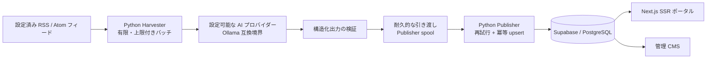

<div align="center">

# Little Mere News

**AI・キュー・認可の境界を明示した、決定論的なテクノロジーニュース・パイプライン。**

Little Mere News は、Next.js のポータル/CMS、有限の Python RSS/Atom 取り込み、設定可能な AI プロバイダー境界、耐久性のある公開キュー、Supabase/PostgreSQL の認可制御を組み合わせたプロジェクトです。

<a href="../../../README.md">English</a> · <a href="../pt-BR/README.md">Português</a> · <strong>日本語</strong> · <a href="../es/README.md">Español</a>

[](https://github.com/Gyliardson/little-mere-news/actions/workflows/ci.yml)
[](../../../LICENSE)

</div>

## 概要

Little Mere News は、設定された RSS/Atom フィードの要約から英語/ポルトガル語のバイリンガル記事ペイロードを生成し、生成された構造を検証し、障害後に復旧可能なキューで処理を引き渡し、公開ポータルと管理 CMS のために制御された Supabase/PostgreSQL 境界を通して公開します。

ソース取り込み、AI 支援生成、公開、データベース認可、フロントエンド配信を分離し、それぞれの境界を独立してレビュー・テストできる構成です。

## Little Mere News を選ぶ理由

| 決定論的なフィード取り込み | 明示的な AI / 編集境界 | 耐久性のある公開整合性 |
| --- | --- | --- |
| 上限付き RSS/Atom 取得、ソース/鮮度検証、有限 Harvester バッチ、決定論的なテストデータにより、重要な検証をライブフィードから切り離します。 | AI 生成は明示的かつ設定可能です。スキーマ検証はペイロード形式を制約しますが、事実確認を保証しません。 | 不変の引き渡し ID、上限付きの再試行/隔離、DB 一意性により、クラッシュ・再試行・再処理をまたいで処理を保護します。 |

## 主な機能

- Next.js App Router による公開テクノロジーニュース・ポータルと管理 CMS;
- 設定された RSS/Atom **フィード要約**から生成される英語/ポルトガル語のバイリンガル記事ペイロード;
- 外部フィード通信を制限し、SSRF を意識した宛先制御を備える有限 Harvester 実行;
- 通常の記事生成に使う、設定可能な Ollama 互換 AI プロバイダー境界;
- Harvester の処理権と Publisher の inbox/processing 状態を耐久的に管理;
- Publisher の上限付き再試行、耐久的な隔離、`source_url` による再処理安全な冪等性、upsert;
- Supabase Auth、`public.admin_users` への明示的な所属、サーバー側認可、PostgreSQL RLS;
- フロントエンド、Python、PostgreSQL、ブラウザ、依存関係、シークレット検出、CodeQL の決定論的な検証。

## アーキテクチャ



Harvester は外部配信元の記事ページ全文をダウンロードせず、設定されたフィードデータを処理します。データベース状態と認可は `supabase/` でバージョン管理され、Hyper-V/Ollama トポロジーはアーキテクチャ上の必須条件ではなく、任意のデプロイ方式です。

## コンテンツ・パイプライン

`設定済み RSS/Atom フィード → 上限付き取得/解析 → 鮮度/ソース検証 → フィード要約の正規化 → AI 生成 → 構造化出力検証 → Harvester からの耐久的な引き渡し → Publisher の spool/再試行 → Supabase/PostgreSQL → フロントエンド`

Harvester の各呼び出しは **有限のバッチ処理**です。継続的なポーリングループや取り込みスケジューラーはこのリポジトリでバージョン管理されていません。24 時間という値は鮮度の判定期間であり、`Infrastructure/Run-LMN-Batch.ps1` はバッチを明示的に実行するオーケストレーターです。フロントエンドの再検証も取り込み頻度を定義しません。

## 技術的ハイライト

- **フィード要約ベースの取り込み。** 通常生成では RSS/Atom エントリの正規化された `summary` と永続的なソース URL を使い、外部配信元の記事ページ全文を取得しません。
- **設定可能な AI 境界。** `OLLAMA_API_URL` がプロバイダーのエンドポイントを選択します。ローカル Ollama は文書化された既定のデプロイ慣例であり、推論が常にローカルに留まるというアーキテクチャ上の保証ではありません。
- **構造化出力検証。** AI 出力は公開経路へ入る前に、期待される JSON/記事フィールド契約を満たす必要があります。
- **耐久的なキュー所有権。** Harvester の処理権と Publisher の inbox/processing ファイルは個別 ID で管理され、クリーンアップによって以前共有されていたパス名上の新しい処理が削除されないようにします。
- **上限付き再試行と冪等性。** Publisher の再試行では、一時障害を示す構造化情報、耐久的な再試行メタデータ、隔離、`news.source_url` の DB 一意性を使います。
- **Auth + 管理者所属 + RLS。** Supabase Auth が識別情報を確立し、サーバー側の確認で `public.admin_users` への所属を要求し、PostgreSQL RLS がブラウザ経由の書き込みを独立して制限します。
- **決定論的 CI。** 重要なテストはライブフィード、本番 Supabase、Ollama、GPU、Hyper-V に依存せず、リポジトリ内のテストデータとローカル/使い捨てサービスを使います。
- **明示的な実行スケジュール境界。** スケジューラーや継続的な取り込みループはバージョン管理されておらず、鮮度フィルターを実行頻度として説明してはいけません。

## インターフェース

リポジトリ所有の代表的なスクリーンショットは、密な 2 カラムに 400px で圧縮せず、読みやすい幅で表示します。

### 公開ポータル

<p align="center">
  
</p>

### 管理ダッシュボード

<p align="center">
  
</p>

### 管理ログイン

<p align="center">
  
</p>

### CMS 記事管理

<p align="center">
  
</p>

## AI / 編集境界

通常の Harvester 記事生成には有効な AI 応答が必要です。プロバイダー障害時に、生のコンテンツや非 AI の代替処理が通常の記事を黙って生成する経路はありません。

AI 出力には事実誤認やハルシネーション、文脈の欠落、要約・翻訳・ローカライズ時の内容のずれが含まれる可能性があります。構造化出力検証が確認するのはペイロード形式であり、**事実の正確性ではありません**。このリポジトリには独立したファクトチェックも実装されていません。フィードの抜粋が不完全だったり途中で切れていたりする場合もあります。完全な文脈と編集上の意味については、元の配信元/ソースを正とします。

`OLLAMA_API_URL` は設定可能なため、ローカル Ollama は文書化されたトポロジー上の慣例であり、すべての推論がローカルで行われるという保証ではありません。

## クイックスタート

### フロントエンド

```bash
cd frontend-web
npm ci
cp .env.example .env.local
npm run dev
```

`.env.local` に Supabase の公開値と `ADMIN_PHANTOM_PATH` を設定します。`SUPABASE_SERVICE_ROLE_KEY` はサーバー専用とし、`NEXT_PUBLIC_*`、ブラウザ側コード、スクリーンショット、ログ、バージョン管理されたファイルへ公開しないでください。

リポジトリ全体の実行環境契約、DB 構築、Python ワーカー、クリーン環境での検証は [デプロイ文書](../../operations/DEPLOYMENT.md) を参照してください。決定論的なローカルテスト手順は [テスト文書](../../assurance/TESTING.md) にあります。

## 品質とセキュリティ

セキュリティは、推測しにくい管理 URL に **依存しません**。`ADMIN_PHANTOM_PATH` は URL を推測しにくくするだけの仕組みであり、認証、認可、セキュリティ境界ではありません。

管理アクセスは次の 3 層で強制されます。

1. Supabase Auth が認証済みセッションを確立する。
2. サーバー側の認可が `public.admin_users` への明示的な所属を確認する。
3. PostgreSQL RLS がブラウザ経由の書き込みを認証済み管理者に独立して制限する。

CI はフロントエンドのビルド/型品質、Harvester/Publisher の決定論的テスト、PostgreSQL のマイグレーション/RLS 契約、ブラウザ E2E/アクセシビリティ、依存関係監査、コミット済みシークレットの検出、CodeQL を実行します。検証成功は実際に確認した性質についての証拠であり、包括的な本番運用準備やセキュリティを保証するものではありません。

詳細は [外向き通信のネットワークセキュリティ](../../security/OUTBOUND_NETWORK_SECURITY.md) と [テスト/保証](../../assurance/TESTING.md) を参照してください。

## ドキュメント

[技術ドキュメント・ハブ](../../README.md) が、詳細なエンジニアリング資料の正本となる索引です。

- [セキュリティ — 外向きフィードの信頼境界](../../security/OUTBOUND_NETWORK_SECURITY.md)
- [信頼性 — Publisher キューの所有権](../../reliability/PUBLISHER_QUEUE_OWNERSHIP.md)
- [信頼性 — Publisher の再試行ポリシー](../../reliability/PUBLISHER_RETRY_POLICY.md)
- [運用 — デプロイとクリーン環境での実行契約](../../operations/DEPLOYMENT.md)
- [保証 — 決定論的テスト](../../assurance/TESTING.md)

詳細な技術ドキュメントは英語版を正本とし、訪問者向けのプロジェクト概要は 4 言語で維持します。

## 運用上の制約

- 外部の配信元やフィードは、メタデータ、可用性、リダイレクト、レート制限の挙動を予告なく変更できます。
- 通常の Harvester 生成には有効な AI 応答が必要で、AI 出力は事実についての正本ではありません。
- Harvester 実行は有限バッチです。スケジューラーや継続的なポーリングループはバージョン管理されておらず、24 時間の鮮度判定期間は取り込み頻度ではありません。
- 決定論的なテストデータと CI は、本番 Supabase、ネットワーク、DNS、プロバイダーの可用性、プラットフォーム設定に対するデプロイ固有のスモークテストの代替ではありません。
- 本番マイグレーションは既存データに対する確認が必要で、一意性マイグレーションは重複レコードを黙って削除しません。
- Hyper-V オーケストレーションは任意かつ環境依存であり、唯一の開発/実行経路ではありません。

## ライセンス / サードパーティ・コンテンツ境界

このリポジトリは、適用可能な範囲でソフトウェアおよびプロジェクト独自の資料に標準の **MIT License** を使用します。MIT License は外部配信元の記事、第三者 RSS/Atom フィードの内容、第三者のロゴや商標、外部の編集素材を **再ライセンスしません**。

外部コンテンツの権利は、各ソースに適用される条件と権利者に従います。RSS/Atom フィードを取得または解析すること自体は、配信元コンテンツの再公開権を付与せず、再利用の許可があることを意味しません。

リポジトリのソフトウェア・ライセンスは [LICENSE](../../../LICENSE) を参照してください。

## 作者

**Gyliardson Keitison** · [GitHub](https://github.com/Gyliardson) · [LinkedIn](https://www.linkedin.com/in/gyliardson-keitison)