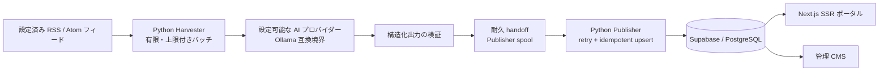

<div align="center">

# Little Mere News

**AI・キュー・認可の境界を明示した、決定論的なテクノロジーニュース・パイプライン。**

Little Mere News は、Next.js のポータル/CMS、有限の Python RSS/Atom 取り込み、設定可能な AI プロバイダー境界、耐久性のある公開キュー、Supabase/PostgreSQL の認可制御を組み合わせたプロジェクトです。

[English](../../../README.md) · [Português](../pt-BR/README.md) · [日本語](README.md) · [Español](../es/README.md)

[](https://github.com/Gyliardson/little-mere-news/actions/workflows/ci.yml)
[](../../../LICENSE)

</div>

## 概要

Little Mere News は、設定された RSS/Atom フィードの要約から英語/ポルトガル語のバイリンガル記事ペイロードを生成し、生成された構造を検証し、障害後に復旧可能なキューで処理を引き渡し、公開ポータルと管理 CMS のために制御された Supabase/PostgreSQL 境界を通して公開します。

ソース取り込み、AI 支援生成、公開、データベース認可、フロントエンド配信を分離し、それぞれの境界を独立してレビュー・テストできる構成です。

## Little Mere News を選ぶ理由

| 決定論的なフィード取り込み | 明示的な AI / 編集境界 | 耐久性のある公開整合性 |
| --- | --- | --- |
| 上限付き RSS/Atom 取得、ソース/鮮度検証、有限 Harvester バッチ、決定論的 fixture により、重要な検証をライブフィードから切り離します。 | AI 生成は明示的かつ設定可能です。スキーマ検証はペイロード形式を制約しますが、事実確認を保証しません。 | 不変の handoff ID、上限付き retry/quarantine、DB 一意性により、クラッシュ・再試行・replay をまたいで処理を保護します。 |

## 主な機能

- Next.js App Router による公開テクノロジーニュース・ポータルと管理 CMS;
- 設定された RSS/Atom **フィード要約**から生成される英語/ポルトガル語のバイリンガル記事ペイロード;
- 外部フィード通信を制限し、SSRF を意識した宛先制御を備える有限 Harvester 実行;
- 通常の記事生成に使う、設定可能な Ollama 互換 AI プロバイダー境界;
- 耐久性のある Harvester claim と Publisher inbox/processing ownership;
- 上限付き Publisher retry、耐久 quarantine、`source_url` replay-safe idempotency、upsert;
- Supabase Auth、明示的な `public.admin_users` membership、サーバー側認可、PostgreSQL RLS;
- フロントエンド、Python、PostgreSQL、ブラウザ、依存関係、secret scan、CodeQL の決定論的 gate。

## アーキテクチャ



Harvester は publisher の記事ページ全文をダウンロードせず、設定されたフィードデータを処理します。データベース状態と認可は `supabase/` で version control され、Hyper-V/Ollama トポロジーはアーキテクチャ上の必須条件ではなく、任意のデプロイ方式です。

## コンテンツ・パイプライン

`設定済み RSS/Atom フィード → 上限付き fetch/parse → 鮮度/ソース検証 → フィード要約の正規化 → AI 生成 → 構造化出力検証 → 耐久 Harvester handoff → Publisher spool/retry → Supabase/PostgreSQL → frontend`

Harvester の各呼び出しは **有限のバッチ処理**です。継続 polling loop や取り込み scheduler はこのリポジトリに version control されていません。24 時間という値は freshness window であり、`Infrastructure/Run-LMN-Batch.ps1` は明示的な batch orchestrator です。フロントエンドの revalidation も取り込み cadence を定義しません。

## 技術的ハイライト

- **フィード要約ベースの取り込み。** 通常生成では RSS/Atom entry の正規化された `summary` と永続的な source URL を使い、publisher 記事ページ全文を取得しません。
- **設定可能な AI 境界。** `OLLAMA_API_URL` が provider endpoint を選択します。ローカル Ollama は文書化された既定のデプロイ慣例であり、推論が常にローカルに留まるというアーキテクチャ保証ではありません。
- **構造化出力検証。** AI 出力は公開経路へ入る前に、期待される JSON/記事フィールド契約を満たす必要があります。
- **耐久キュー ownership。** Harvester claim と Publisher inbox/processing は個別 ID で所有され、cleanup が以前共有されていた pathname 上の新しい処理を削除しないようにします。
- **上限付き retry と idempotency。** Publisher retry は構造化された一時障害の証拠、耐久 retry metadata、quarantine、`news.source_url` の DB 一意性を使います。
- **Auth + admin membership + RLS。** Supabase Auth が identity を確立し、サーバー側 check が `public.admin_users` を要求し、PostgreSQL RLS がブラウザ経由の mutation を独立して制限します。
- **決定論的 CI。** 重要なテストはライブフィード、production Supabase、Ollama、GPU、Hyper-V に依存せず、リポジトリ所有 fixture とローカル/使い捨てサービスを使います。
- **明示的な scheduling 境界。** scheduler や継続 ingestion loop は version control されておらず、freshness filter を実行 cadence と表現してはいけません。

## インターフェース

リポジトリ所有の代表的な screenshot は、密な 2 カラムに 400px で圧縮せず、読みやすい幅で表示します。

### 公開ポータル

<p align="center">
  
</p>

### 管理ダッシュボード

<p align="center">
  
</p>

### 管理ログイン

<p align="center">
  
</p>

### CMS 記事管理

<p align="center">
  
</p>

## AI / 編集境界

通常の Harvester 記事生成には有効な AI 応答が必要です。プロバイダー障害時に、raw content や非 AI fallback が通常の記事を黙って生成する経路はありません。

AI 出力には事実誤認や hallucination、文脈の欠落、要約・翻訳・localization 時の drift が含まれる可能性があります。構造化出力検証が確認するのはペイロード形式であり、**事実の正確性ではありません**。このリポジトリには独立した fact-checking も実装されていません。フィード excerpt が不完全または truncate される場合もあります。完全な文脈と編集上の意味については、元の publisher/source が authoritative です。

`OLLAMA_API_URL` は設定可能なため、ローカル Ollama は文書化されたトポロジーの慣例であり、すべての推論がローカルで行われるという保証ではありません。

## クイックスタート

### Frontend

```bash
cd frontend-web
npm ci
cp .env.example .env.local
npm run dev
```

`.env.local` に Supabase の public 値と `ADMIN_PHANTOM_PATH` を設定します。`SUPABASE_SERVICE_ROLE_KEY` は server-only とし、`NEXT_PUBLIC_*`、browser code、screenshot、log、version control されたファイルへ公開しないでください。

リポジトリ全体の runtime 契約、DB setup、Python worker、clean-room verification は [deployment documentation](../../operations/DEPLOYMENT.md) を参照してください。決定論的なローカルテスト手順は [testing](../../assurance/TESTING.md) にあります。

## 品質とセキュリティ

セキュリティは、推測しにくい管理 URL に **依存しません**。`ADMIN_PHANTOM_PATH` は URL obscurity にすぎず、authentication、authorization、security boundary ではありません。

管理アクセスは次の 3 層で強制されます。

1. Supabase Auth が認証済み session を確立する。
2. server-side authorization が `public.admin_users` への明示的 membership を確認する。
3. PostgreSQL RLS が browser-facing write を認証済み管理者へ独立して制限する。

CI は frontend build/type quality、Harvester/Publisher の決定論的テスト、PostgreSQL migration/RLS contract、browser E2E/accessibility、dependency audit、committed-secret scan、CodeQL を実行します。green gate は実際に実行した性質の証拠であり、包括的な production readiness や security の保証ではありません。

詳細は [outbound network security](../../security/OUTBOUND_NETWORK_SECURITY.md) と [testing/assurance](../../assurance/TESTING.md) を参照してください。

## ドキュメント

[技術ドキュメント・ハブ](../../README.md) が、詳細な engineering documentation の canonical index です。

- [Security — outbound feed trust boundary](../../security/OUTBOUND_NETWORK_SECURITY.md)
- [Reliability — Publisher queue ownership](../../reliability/PUBLISHER_QUEUE_OWNERSHIP.md)
- [Reliability — Publisher retry policy](../../reliability/PUBLISHER_RETRY_POLICY.md)
- [Operations — deployment / clean-room runtime contract](../../operations/DEPLOYMENT.md)
- [Assurance — deterministic testing](../../assurance/TESTING.md)

詳細な技術ドキュメントは英語を canonical とし、訪問者向けの project overview は 4 言語で維持します。

## 運用上の制約

- 外部 publisher/feed は metadata、availability、redirect、rate behavior を予告なく変更できます。
- 通常の Harvester 生成には有効な AI 応答が必要で、AI 出力は authoritative な事実ではありません。
- Harvester 実行は有限バッチです。scheduler や継続 polling loop は version control されておらず、24 時間の freshness window は ingestion cadence ではありません。
- 決定論的 fixture/CI は production Supabase、network、DNS、provider availability、platform configuration に対する deployment-specific smoke test の代替ではありません。
- production migration は既存データに対して review が必要で、uniqueness migration は duplicate record を黙って削除しません。
- Hyper-V orchestration は任意かつ environment-specific であり、唯一の development/runtime path ではありません。

## ライセンス / サードパーティ・コンテンツ境界

このリポジトリは、適用可能な範囲でソフトウェアおよびプロジェクト独自の資料に標準の **MIT License** を使用します。MIT License は publisher の記事、第三者 RSS/Atom フィード内容、第三者のロゴや商標、外部の編集素材を **再ライセンスしません**。

外部コンテンツの権利は、各ソースの適用条件と権利者に従います。RSS/Atom フィードを取得または解析すること自体は、publisher コンテンツの再公開権を付与せず、再利用許可があることを意味しません。

リポジトリのソフトウェア・ライセンスは [LICENSE](../../../LICENSE) を参照してください。

## 作者

**Gyliardson Keitison** · [GitHub](https://github.com/Gyliardson) · [LinkedIn](https://www.linkedin.com/in/gyliardson-keitison)
