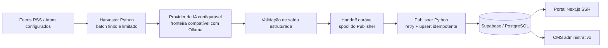
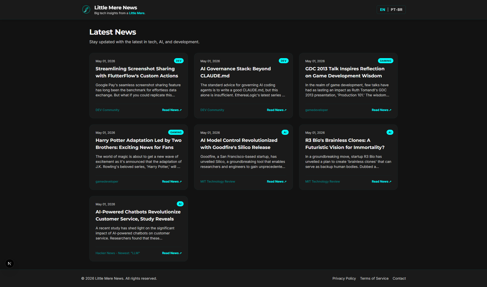
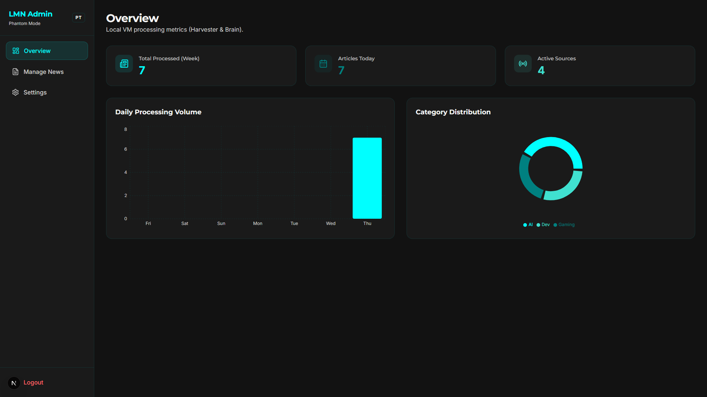
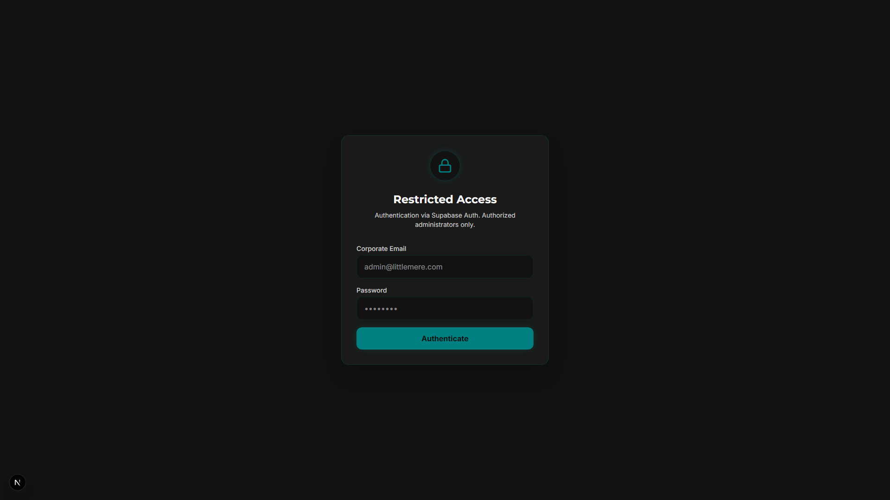
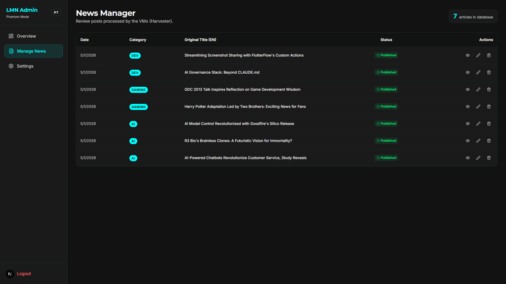

<div align="center">

# Little Mere News

**Um pipeline determinístico de notícias de tecnologia com fronteiras explícitas de IA, filas e autorização.**

Little Mere News combina um portal e CMS em Next.js, ingestão finita de RSS/Atom em Python, uma fronteira configurável de provider de IA, filas duráveis de publicação e controles de autorização em Supabase/PostgreSQL.

[English](../../../README.md) · [Português](README.md) · [日本語](../ja/README.md) · [Español](../es/README.md)

[](https://github.com/Gyliardson/little-mere-news/actions/workflows/ci.yml)
[](../../../LICENSE)

</div>

## Visão geral

Little Mere News transforma resumos de feeds RSS/Atom configurados em payloads bilíngues de artigos em inglês/português, valida a estrutura gerada, transfere o trabalho por filas recuperáveis após falhas e publica por uma fronteira controlada de Supabase/PostgreSQL para o portal público e o CMS administrativo.

O repositório separa ingestão de fontes, geração assistida por IA, publicação, autorização no banco e entrega pelo frontend para que cada fronteira possa ser revisada e testada de forma independente.

## Por que Little Mere News?

| Ingestão determinística de feeds | Fronteira explícita de IA / editorial | Integridade durável de publicação |
| --- | --- | --- |
| Fetches RSS/Atom limitados, validação de fonte/freshness, batches finitos do Harvester e fixtures determinísticas mantêm a verificação crítica independente de feeds reais. | A geração por IA é explícita e configurável; a validação de schema restringe o formato do payload sem alegar verificação factual. | Identidade imutável de handoff, retry/quarentena limitados e unicidade no banco protegem o trabalho durante crashes, retries e replay. |

## Capacidades principais

- portal público de notícias de tecnologia e CMS administrativo com Next.js App Router;
- payloads bilíngues inglês/português gerados a partir de **resumos de feeds** RSS/Atom configurados;
- execução finita do Harvester com transporte externo limitado e controles de destino voltados à mitigação de SSRF;
- fronteira configurável de provider de IA compatível com Ollama para a geração normal de artigos;
- claims duráveis do Harvester e ownership de inbox/processing do Publisher;
- retry limitado do Publisher, quarentena durável, idempotência por `source_url` e upsert seguro para replay;
- Supabase Auth, membership explícita em `public.admin_users`, autorização server-side e PostgreSQL RLS;
- gates determinísticos de frontend, Python, PostgreSQL, browser, dependências, secret scanning e CodeQL.

## Arquitetura



O Harvester processa os dados dos feeds configurados em vez de baixar as páginas completas dos artigos dos publishers. O estado e a autorização do banco são versionados em `supabase/`, enquanto a topologia opcional Hyper-V/Ollama continua sendo uma escolha de deploy, não um pré-requisito arquitetural.

## Pipeline de conteúdo

`feeds RSS/Atom configurados → fetch/parse limitado → validação de freshness/fonte → normalização do resumo do feed → geração por IA → validação de saída estruturada → handoff durável do Harvester → spool/retry do Publisher → Supabase/PostgreSQL → frontend`

Cada invocação do Harvester é um **batch finito**. O repositório não versiona loop de polling contínuo nem scheduler de ingestão. O valor de 24 horas é uma janela de freshness, `Infrastructure/Run-LMN-Batch.ps1` é um orquestrador explícito de batch e o revalidate do frontend não define cadência de ingestão.

## Destaques técnicos

- **Ingestão baseada no resumo do feed.** A geração normal usa texto normalizado do `summary` da entrada RSS/Atom e URLs de fonte duráveis; não busca a página completa do artigo do publisher.
- **Fronteira de IA configurável.** `OLLAMA_API_URL` seleciona o endpoint do provider. Ollama local é a convenção padrão documentada de deploy, não uma garantia arquitetural de que a inferência permaneça local.
- **Validação de saída estruturada.** A saída da IA deve satisfazer o contrato esperado de JSON/campos de artigo antes de entrar no caminho de publicação.
- **Ownership durável de filas.** Claims do Harvester e arquivos inbox/processing do Publisher usam identidade específica para que a limpeza não exclua trabalho mais novo em um pathname anteriormente compartilhado.
- **Retry limitado e idempotência.** Retries do Publisher usam evidência estruturada de transiência, metadata durável, quarentena e unicidade no banco em `news.source_url`.
- **Auth + membership administrativa + RLS.** Supabase Auth estabelece identidade, checks server-side exigem `public.admin_users` e PostgreSQL RLS restringe de forma independente mutações expostas ao browser.
- **CI determinística.** Testes críticos usam fixtures do repositório e serviços locais/descartáveis em vez de depender de feeds reais, Supabase de produção, Ollama, GPU ou Hyper-V.
- **Fronteira explícita de scheduling.** Nenhum scheduler ou loop contínuo de ingestão é versionado; o filtro de freshness não deve ser descrito como cadência de execução.

## Interface

Screenshots representativos do próprio repositório são exibidos em largura legível, em vez de comprimidos em um layout denso de duas colunas.

### Portal público

<p align="center">
  
</p>

### Dashboard administrativo

<p align="center">
  
</p>

### Login administrativo

<p align="center">
  
</p>

### Gerenciamento de artigos no CMS

<p align="center">
  
</p>

## Fronteira de IA / editorial

A geração normal de artigos do Harvester exige uma resposta válida de IA; não existe fallback de conteúdo bruto nem fallback sem IA que crie silenciosamente um artigo normal quando o provider falha.

A saída da IA pode conter erros factuais ou hallucinations, omitir contexto ou sofrer drift durante paráfrase, tradução ou localização. A validação de saída estruturada verifica o formato do payload, **não a precisão factual**, e o repositório não implementa fact-checking independente. Excertos dos feeds também podem estar incompletos ou truncados. O publisher/fonte original continua sendo a referência autoritativa para contexto completo e sentido editorial.

Como `OLLAMA_API_URL` é configurável, um deploy local com Ollama é uma convenção da topologia documentada, não uma garantia de que toda inferência seja local.

## Início rápido

### Frontend

```bash
cd frontend-web
npm ci
cp .env.example .env.local
npm run dev
```

Configure os valores públicos do Supabase e `ADMIN_PHANTOM_PATH` em `.env.local`. Mantenha `SUPABASE_SERVICE_ROLE_KEY` apenas no servidor e nunca a exponha por `NEXT_PUBLIC_*`, código de browser, screenshots, logs ou arquivos versionados.

Para o contrato de runtime do repositório, setup de banco, workers Python e verificação clean-room, consulte a [documentação de deployment](../../operations/DEPLOYMENT.md). Os comandos determinísticos de testes locais estão em [testing](../../assurance/TESTING.md).

## Qualidade e segurança

A segurança **não depende** de uma URL administrativa difícil de adivinhar. `ADMIN_PHANTOM_PATH` é apenas obscuridade de URL e não é autenticação, autorização nem uma fronteira de segurança.

O acesso administrativo é aplicado por três camadas distintas:

1. Supabase Auth estabelece a sessão autenticada.
2. A autorização server-side verifica membership explícita em `public.admin_users`.
3. PostgreSQL RLS restringe de forma independente as escritas expostas ao browser a administradores autenticados.

A CI exercita qualidade de build/tipagem do frontend, testes determinísticos do Harvester e Publisher, contratos de migrations/RLS do PostgreSQL, E2E/acessibilidade em browser, auditoria de dependências, secret scanning de commits e CodeQL. Um gate verde é evidência apenas para a propriedade que ele executa, não uma garantia universal de prontidão de produção ou segurança.

Consulte [segurança de rede outbound](../../security/OUTBOUND_NETWORK_SECURITY.md) e [testing/assurance](../../assurance/TESTING.md) para os limites detalhados.

## Documentação

O [hub de documentação técnica](../../README.md) é o índice canônico para material de engenharia aprofundado.

- [Segurança — fronteira de confiança dos feeds outbound](../../security/OUTBOUND_NETWORK_SECURITY.md)
- [Confiabilidade — ownership da fila do Publisher](../../reliability/PUBLISHER_QUEUE_OWNERSHIP.md)
- [Confiabilidade — política de retry do Publisher](../../reliability/PUBLISHER_RETRY_POLICY.md)
- [Operações — deployment e contrato de runtime clean-room](../../operations/DEPLOYMENT.md)
- [Assurance — testes determinísticos](../../assurance/TESTING.md)

A documentação técnica aprofundada permanece canônica em inglês; a visão pública do projeto é mantida em quatro idiomas.

## Limitações operacionais

- Publishers externos e feeds podem alterar metadata, disponibilidade, redirects ou comportamento de rate limit sem aviso.
- A geração normal do Harvester exige uma resposta válida de IA; a saída de IA não é verdade factual autoritativa.
- Execuções do Harvester são batches finitos. Nenhum scheduler ou loop contínuo de polling é versionado, e a janela de freshness de 24 horas não é cadência de ingestão.
- Fixtures determinísticas e CI não substituem smoke checks específicos de deploy para Supabase de produção, rede, DNS, disponibilidade do provider ou configuração de plataforma.
- Migrations de produção devem ser revisadas contra dados existentes; a migration de unicidade intencionalmente não apaga duplicatas de forma silenciosa.
- A orquestração Hyper-V é opcional e específica de ambiente, não o único caminho suportado de desenvolvimento/runtime.

## Licença / fronteira de conteúdo de terceiros

O repositório usa a **Licença MIT** padrão para o software e os materiais originais do projeto, na medida aplicável. A licença MIT **não relicencia** artigos de publishers, conteúdo de feeds RSS/Atom de terceiros, logos ou marcas de terceiros nem material editorial externo.

Os direitos sobre conteúdo externo continuam sujeitos aos termos aplicáveis de cada fonte e aos respectivos titulares. Consumir ou fazer parsing de um feed RSS/Atom **não**, por si só, concede direitos de republicação nem estabelece permissão para reutilizar conteúdo do publisher.

Consulte [LICENSE](../../../LICENSE) para a licença do software do repositório.

## Autor

**Gyliardson Keitison** · [GitHub](https://github.com/Gyliardson) · [LinkedIn](https://www.linkedin.com/in/gyliardson-keitison)
