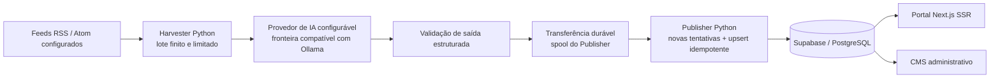

<div align="center">

# Little Mere News

**Um pipeline determinístico de notícias de tecnologia com fronteiras explícitas de IA, filas e autorização.**

Little Mere News combina um portal e CMS em Next.js, ingestão finita de RSS/Atom em Python, uma fronteira configurável de provedor de IA, filas duráveis de publicação e controles de autorização em Supabase/PostgreSQL.

<a href="../../../README.md">English</a> · <strong>Português</strong> · <a href="../ja/README.md">日本語</a> · <a href="../es/README.md">Español</a>

[](https://github.com/Gyliardson/little-mere-news/actions/workflows/ci.yml)
[](../../../LICENSE)

</div>

## Visão geral

Little Mere News transforma resumos de feeds RSS/Atom configurados em payloads bilíngues de artigos em inglês/português, valida a estrutura gerada, transfere o trabalho por filas recuperáveis após falhas e publica por uma fronteira controlada de Supabase/PostgreSQL para o portal público e o CMS administrativo.

O repositório separa ingestão de fontes, geração assistida por IA, publicação, autorização no banco e entrega pelo frontend para que cada fronteira possa ser revisada e testada de forma independente.

## Por que Little Mere News?

| Ingestão determinística de feeds | Fronteira explícita de IA / editorial | Integridade durável de publicação |
| --- | --- | --- |
| Buscas RSS/Atom limitadas, validação de fonte/recência, lotes finitos do Harvester e dados de teste determinísticos mantêm a verificação crítica independente de feeds reais. | A geração por IA é explícita e configurável; a validação de esquema restringe o formato do payload sem alegar verificação factual. | Identidade imutável de transferência, novas tentativas/quarentena limitadas e unicidade no banco protegem o trabalho durante falhas abruptas, novas tentativas e reprocessamento. |

## Capacidades principais

- portal público de notícias de tecnologia e CMS administrativo com Next.js App Router;
- payloads bilíngues inglês/português gerados a partir de **resumos de feeds** RSS/Atom configurados;
- execução finita do Harvester com transporte externo limitado e controles de destino voltados à mitigação de SSRF;
- fronteira configurável de provedor de IA compatível com Ollama para a geração normal de artigos;
- controle durável de posse dos trabalhos do Harvester e dos estados inbox/processing do Publisher;
- novas tentativas limitadas do Publisher, quarentena durável, idempotência por `source_url` e upsert seguro para reprocessamento;
- Supabase Auth, associação explícita em `public.admin_users`, autorização no servidor e PostgreSQL RLS;
- verificações determinísticas de frontend, Python, PostgreSQL, navegador, dependências, varredura de segredos e CodeQL.

## Arquitetura



O Harvester processa os dados dos feeds configurados em vez de baixar as páginas completas dos artigos das fontes publicadoras. O estado e a autorização do banco são versionados em `supabase/`, enquanto a topologia opcional Hyper-V/Ollama continua sendo uma escolha de implantação, não um pré-requisito arquitetural.

## Pipeline de conteúdo

`feeds RSS/Atom configurados → busca/análise limitada → validação de recência/fonte → normalização do resumo do feed → geração por IA → validação de saída estruturada → transferência durável do Harvester → spool/novas tentativas do Publisher → Supabase/PostgreSQL → frontend`

Cada invocação do Harvester é um **lote finito**. O repositório não versiona loop de consulta contínua nem agendador de ingestão. O valor de 24 horas é uma janela de recência, `Infrastructure/Run-LMN-Batch.ps1` é um orquestrador explícito de lotes e a revalidação do frontend não define a cadência de ingestão.

## Destaques técnicos

- **Ingestão baseada no resumo do feed.** A geração normal usa texto normalizado do `summary` da entrada RSS/Atom e URLs de fonte duráveis; não busca a página completa do artigo da fonte publicadora.
- **Fronteira de IA configurável.** `OLLAMA_API_URL` seleciona o endpoint do provedor. Ollama local é a convenção padrão documentada de implantação, não uma garantia arquitetural de que a inferência permaneça local.
- **Validação de saída estruturada.** A saída da IA deve satisfazer o contrato esperado de JSON/campos de artigo antes de entrar no caminho de publicação.
- **Posse durável das filas.** Os trabalhos do Harvester e os arquivos inbox/processing do Publisher usam identidade específica para que a limpeza não exclua trabalho mais novo em um caminho anteriormente compartilhado.
- **Novas tentativas limitadas e idempotência.** As novas tentativas do Publisher usam evidência estruturada de transiência, metadados duráveis, quarentena e unicidade no banco em `news.source_url`.
- **Auth + associação administrativa + RLS.** Supabase Auth estabelece identidade, verificações no servidor exigem `public.admin_users` e PostgreSQL RLS restringe de forma independente mutações expostas ao navegador.
- **CI determinística.** Testes críticos usam dados de teste do repositório e serviços locais/descartáveis em vez de depender de feeds reais, Supabase de produção, Ollama, GPU ou Hyper-V.
- **Fronteira explícita de agendamento.** Nenhum agendador ou loop contínuo de ingestão é versionado; o filtro de recência não deve ser descrito como cadência de execução.

## Interface

Capturas de tela representativas do próprio repositório são exibidas em largura legível, em vez de comprimidas em um layout denso de duas colunas.

### Portal público

<p align="center">
  
</p>

### Dashboard administrativo

<p align="center">
  
</p>

### Login administrativo

<p align="center">
  
</p>

### Gerenciamento de artigos no CMS

<p align="center">
  
</p>

## Fronteira de IA / editorial

A geração normal de artigos do Harvester exige uma resposta válida de IA; não existe rota alternativa com conteúdo bruto nem rota sem IA que crie silenciosamente um artigo normal quando o provedor falha.

A saída da IA pode conter erros factuais ou alucinações, omitir contexto ou apresentar desvios durante paráfrase, tradução ou localização. A validação de saída estruturada verifica o formato do payload, **não a precisão factual**, e o repositório não implementa checagem factual independente. Excertos dos feeds também podem estar incompletos ou truncados. O publicador/fonte original continua sendo a referência autoritativa para o contexto completo e o sentido editorial.

Como `OLLAMA_API_URL` é configurável, uma implantação local com Ollama é uma convenção da topologia documentada, não uma garantia de que toda inferência seja local.

## Início rápido

### Frontend

```bash
cd frontend-web
npm ci
cp .env.example .env.local
npm run dev
```

Configure os valores públicos do Supabase e `ADMIN_PHANTOM_PATH` em `.env.local`. Mantenha `SUPABASE_SERVICE_ROLE_KEY` apenas no servidor e nunca a exponha por `NEXT_PUBLIC_*`, código de navegador, capturas de tela, logs ou arquivos versionados.

Para o contrato de execução do repositório, configuração do banco, workers Python e verificação em ambiente limpo, consulte a [documentação de implantação](../../operations/DEPLOYMENT.md). Os comandos determinísticos de testes locais estão em [testes](../../assurance/TESTING.md).

## Qualidade e segurança

A segurança **não depende** de uma URL administrativa difícil de adivinhar. `ADMIN_PHANTOM_PATH` é apenas obscuridade de URL e não é autenticação, autorização nem uma fronteira de segurança.

O acesso administrativo é aplicado por três camadas distintas:

1. Supabase Auth estabelece a sessão autenticada.
2. A autorização no servidor verifica associação explícita em `public.admin_users`.
3. PostgreSQL RLS restringe de forma independente as escritas expostas ao navegador a administradores autenticados.

A CI exercita qualidade de build/tipagem do frontend, testes determinísticos do Harvester e Publisher, contratos de migrações/RLS do PostgreSQL, E2E/acessibilidade em navegador, auditoria de dependências, varredura de segredos versionados e CodeQL. Uma verificação aprovada é evidência apenas para a propriedade que ela executa, não uma garantia universal de prontidão para produção ou segurança.

Consulte [segurança de rede de saída](../../security/OUTBOUND_NETWORK_SECURITY.md) e [testes/garantia](../../assurance/TESTING.md) para os limites detalhados.

## Documentação

O [hub de documentação técnica](../../README.md) é o índice canônico para material de engenharia aprofundado.

- [Segurança — fronteira de confiança dos feeds de saída](../../security/OUTBOUND_NETWORK_SECURITY.md)
- [Confiabilidade — posse da fila do Publisher](../../reliability/PUBLISHER_QUEUE_OWNERSHIP.md)
- [Confiabilidade — política de novas tentativas do Publisher](../../reliability/PUBLISHER_RETRY_POLICY.md)
- [Operações — implantação e contrato de execução em ambiente limpo](../../operations/DEPLOYMENT.md)
- [Garantia — testes determinísticos](../../assurance/TESTING.md)

A documentação técnica aprofundada permanece canônica em inglês; a visão pública do projeto é mantida em quatro idiomas.

## Limitações operacionais

- Fontes publicadoras externas e feeds podem alterar metadados, disponibilidade, redirecionamentos ou comportamento de limitação de taxa sem aviso.
- A geração normal do Harvester exige uma resposta válida de IA; a saída de IA não é verdade factual autoritativa.
- Execuções do Harvester são lotes finitos. Nenhum agendador ou loop contínuo de consulta é versionado, e a janela de recência de 24 horas não é cadência de ingestão.
- Dados de teste determinísticos e CI não substituem verificações rápidas específicas da implantação para Supabase de produção, rede, DNS, disponibilidade do provedor ou configuração de plataforma.
- Migrações de produção devem ser revisadas contra dados existentes; a migração de unicidade intencionalmente não apaga duplicatas de forma silenciosa.
- A orquestração Hyper-V é opcional e específica de ambiente, não o único caminho suportado de desenvolvimento/execução.

## Licença / fronteira de conteúdo de terceiros

O repositório usa a **Licença MIT** padrão para o software e os materiais originais do projeto, na medida aplicável. A licença MIT **não relicencia** artigos de publicadores, conteúdo de feeds RSS/Atom de terceiros, logos ou marcas de terceiros nem material editorial externo.

Os direitos sobre conteúdo externo continuam sujeitos aos termos aplicáveis de cada fonte e aos respectivos titulares. Consumir ou analisar um feed RSS/Atom **não**, por si só, concede direitos de republicação nem estabelece permissão para reutilizar conteúdo do publicador.

Consulte [LICENSE](../../../LICENSE) para a licença do software do repositório.

## Autor

**Gyliardson Keitison** · [GitHub](https://github.com/Gyliardson) · [LinkedIn](https://www.linkedin.com/in/gyliardson-keitison)
